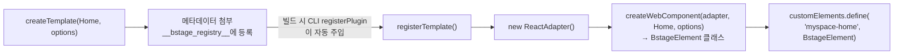

# bstage Template SDK API Reference

SDK를 구성하는 Core, React, Host 패키지의 public API를 정리한 문서입니다. 각 API의 시그니처, 파라미터, 사용 예시를 확인할 수 있습니다.

설계 배경과 동작 원리는 [SDK_ARCHITECTURE.md](./SDK_ARCHITECTURE.md)를 참고하세요.

---

## 1. Core

### 1.1 FrameworkAdapter

모든 프레임워크 바인딩이 구현하는 인터페이스입니다.

```typescript
interface FrameworkAdapter<Component = unknown> {
  mount(
    component: Component,
    container: ShadowRoot | HTMLElement,
    props: Record<string, unknown>,
    bridge: PlatformBridge,
  ): void
  update(props: Record<string, unknown>): void
  unmount(): void
}
```

| 메서드    | 설명                                                               |
| --------- | ------------------------------------------------------------------ |
| `mount`   | Shadow DOM 내에 프레임워크 루트를 생성하고 컴포넌트를 렌더링합니다 |
| `update`  | 새로운 props로 컴포넌트를 갱신합니다                               |
| `unmount` | 프레임워크 루트를 정리하고 참조를 해제합니다                       |

### 1.2 createWebComponent

FrameworkAdapter를 받아 `BstageElement` (HTMLElement 서브클래스)를 생성합니다. Custom Element 등록(`customElements.define`)은 하지 않으며, 프레임워크 바인딩이 처리합니다.

```typescript
function createWebComponent<C>(
  createAdapter: () => FrameworkAdapter<C>,
  component: C,
  options: TemplateOptions,
): typeof HTMLElement
```

**파라미터:**

| 파라미터        | 타입                        | 설명                             |
| --------------- | --------------------------- | -------------------------------- |
| `createAdapter` | `() => FrameworkAdapter<C>` | 어댑터 팩토리 함수               |
| `component`     | `C`                         | 렌더링할 프레임워크 컴포넌트     |
| `options`       | `TemplateOptions`           | 템플릿 메타데이터 (name 필수 등) |

**반환값:** `typeof HTMLElement` — BstageElement 클래스

**BstageElement 라이프사이클:**

| 시점                   | 동작                                                       |
| ---------------------- | ---------------------------------------------------------- |
| `constructor`          | Shadow DOM 생성 (`attachShadow({ mode: 'open' })`)         |
| `connectedCallback`    | adapter 생성 → bridge 생성 → adapter.mount() → 렌더링 시작 |
| `disconnectedCallback` | adapter.unmount() → bridge.destroy() → 참조 해제           |

CLI가 빌드 시 소스 코드에서 `createTemplate()` 호출을 파싱해 산출물 경로를 정합니다 (`packages/cli/src/vite/metaPlugin.ts`).

### 1.3 PlatformBridge

템플릿과 플랫폼 사이의 양방향 통신을 담당합니다. CustomEvent 기반이며, 모든 이벤트는 `bstage:{type}` 접두사를 사용합니다.

**Template → Platform** (`bridge.emit`)

| 이벤트          | 페이로드                           | 용도                      |
| --------------- | ---------------------------------- | ------------------------- |
| `navigate`      | `{ path, params? }`                | 앱 내 경로 이동           |
| `go-back`       | `{}`                               | 이전 화면으로 돌아가기    |
| `open-external` | `{ url }`                          | 외부 URL을 새 탭으로 열기 |
| `toast`         | `{ message, duration?, variant? }` | 토스트 메시지 표시        |

Template → Platform 이벤트는 `bubbles: true, composed: true`로 Shadow DOM 경계를 넘어 전파됩니다.

**Platform → Template** (`bridge.on`)

| 이벤트                | 페이로드                  | 용도                                                         |
| --------------------- | ------------------------- | ------------------------------------------------------------ |
| `slot.init`           | `{ resourceId? }`         | 슬롯 초기화. resourceId가 있으면 수정 모드, 없으면 생성 모드 |
| `ticket.create.after` | `{ ticketId, productId }` | 디지털 티켓 생성 완료 (어드민 도메인 이벤트)                 |

Platform → Template 이벤트는 `bubbles: false, composed: false`로 해당 템플릿 요소에만 전달됩니다.

**어드민 도메인 이벤트:**

어드민(어드민 플랫폼) 전용 이벤트는 `adminEvents.ts`의 `ADMIN_EVENT_CATALOG`에서 관리됩니다. 네이밍 컨벤션은 `{domain}.{verb}.{when}` 형식이며, `PlatformEventMap`이 `AdminDomainEventMap`을 extends하므로 Bridge/Handle 타입에 자동 반영됩니다.

### 1.4 BstageClient

서드파티가 b.stage API를 직접 호출할 수 있는 HTTP 클라이언트입니다. 게이트웨이 base URL 해석, 인증 헤더 자동 포함, 플랫폼 주입 fetch 해석을 맡습니다.

> **경로와 응답 모양의 출처는 게이트웨이 API Reference Doc입니다.** SDK가 OpenAPI 스펙에서 경로 타입을 생성해 자동완성을 제공하던 방식은 걷어냈습니다 — 스펙이 바뀌어도 SDK를 새로 배포해야 반영되는 구조라 실제 API 변경을 따라가지 못했습니다. 응답 타입은 호출 시 제네릭으로 명시하세요.

> **지원 범위: 유저단(user-facing) API만.** BstageClient는 게이트웨이(`/gw`)를 타는 **유저 도메인 API**용입니다. **어드민용 API는 지원하지 않습니다** — 어드민은 게이트웨이를 타지 않고 인증 모델도 다릅니다. 어드민 API 호출이 필요한 경우 임의로 경로를 추측해 호출하지 말고 **반드시 사용자에게 먼저 확인**하세요.

```typescript
const client = new BstageClient({
  appId: 'app-xxx',
  appSecret: 'secret-xxx',
  tenantId: 'tenant-xxx',
})
```

**생성자 옵션:**

| 옵션        | 타입                                          | 설명                                                         |
| ----------- | --------------------------------------------- | ------------------------------------------------------------ |
| `appId`     | `string`                                      | 앱 식별자                                                    |
| `appSecret` | `string`                                      | 앱 시크릿                                                    |
| `tenantId`  | `string`                                      | 테넌트 식별자                                                |
| `phase`     | `'dev' \| 'qa' \| 'real' \| 'sandbox'` (선택) | 환경. 현재 미사용 (향후 확장용)                              |
| `baseUrl`   | `string` (선택)                               | base URL 직접 지정. 미지정 시 `resolveBaseUrl()`로 자동 결정 |
| `timeout`   | `number` (선택)                               | 요청 타임아웃 (ms)                                           |
| `fetch`     | `FetchFunction` (선택)                        | 커스텀 fetch 함수 주입                                       |

**base URL 결정 (`resolveBaseUrl`):**

| 우선순위 | 값                   | 설명                               |
| -------- | -------------------- | ---------------------------------- |
| 1        | `config.baseUrl`     | 직접 지정                          |
| 2        | `location.origin/gw` | 브라우저 환경에서 현재 호스트 기반 |
| 3        | `/gw`                | fallback (SSR 등)                  |

로컬 개발 시에는 devVitePlugin이 `resolveBaseUrl()`을 localhost 프록시 URL로 치환합니다.

**fetch 함수 결정:**

| 우선순위 | 값                            | 설명                                             |
| -------- | ----------------------------- | ------------------------------------------------ |
| 1        | `config.fetch`                | 직접 지정                                        |
| 2        | `globalThis.__bstage_fetch__` | 플랫폼이 주입 (Authorization, CF Access 헤더 등) |
| 3        | `globalThis.fetch`            | 기본 fetch                                       |

> `config.fetch`를 주지 않으면 `__bstage_fetch__`/`globalThis.fetch`는 **요청 시점에** 해석됩니다. 플랫폼은 이 값을 템플릿 mount 직전에 주입하므로, 모듈 최상단에서 만든 클라이언트(권장 패턴)도 늦은 주입을 놓치지 않습니다.

**HTTP 메서드:**

```typescript
client.get(path, options?)     // GET 요청
client.post(path, options?)    // POST 요청
client.put(path, options?)     // PUT 요청
client.patch(path, options?)   // PATCH 요청
client.delete(path, options?)  // DELETE 요청
```

**옵션:**

| 옵션      | 대상 메서드          | 타입                               | 설명                                          |
| --------- | -------------------- | ---------------------------------- | --------------------------------------------- |
| `path`    | 전체                 | `Record<string, string \| number>` | 경로 템플릿의 `{param}` 치환값 (URL 인코딩됨) |
| `params`  | `get`                | `Record<string, ...>`              | 쿼리 파라미터                                 |
| `body`    | `post`/`put`/`patch` | `unknown`                          | 요청 바디 (JSON 직렬화)                       |
| `headers` | 전체                 | `Record<string, string>`           | 추가 헤더                                     |
| `timeout` | 전체                 | `number`                           | 이 요청만의 타임아웃 (ms)                     |

**사용 예시:**

```typescript
// 응답 타입은 제네릭으로 명시한다. 생략하면 unknown이다.
const menu = await client.get<MenuResponse>('/home/v1/menu')

// Path 파라미터 포함
const post = await client.get<PostResponse>('/content/v1/boards/{boardId}/posts/{postId}', {
  path: { boardId: 'board-1', postId: 'post-1' },
})
```

응답 타입(`MenuResponse` 등)은 게이트웨이 API Reference Doc을 보고 필요한 필드만 프로젝트 안에 선언해 쓰는 것을 권장합니다.

내부적으로 `HttpClient`(Fetch 기반, 인터셉터 지원)를 사용하며, 모든 요청에 `X-BSTAGE-APP-ID`/`X-BSTAGE-APP-KEY`/`X-BSTAGE-TENANT-ID` 헤더를 자동 포함합니다.

---

## 2. React

### 2.1 createTemplate

bstage 메타데이터가 첨부된 React 컴포넌트를 생성합니다. Web Component 등록(`customElements.define`)은 하지 않으며, 빌드 시 CLI의 `registerPlugin`이 자동 주입하는 `registerTemplate()`이 처리합니다.

```typescript
function createTemplate(
  Component: ComponentType<any>,
  options: CreateTemplateOptions,
): BstageTemplateComponent
```

**파라미터:**

| 파라미터    | 타입                    | 설명                                   |
| ----------- | ----------------------- | -------------------------------------- |
| `Component` | `ComponentType<any>`    | React 컴포넌트                         |
| `options`   | `CreateTemplateOptions` | 템플릿 옵션 (name, slot, type, styles) |

**CreateTemplateOptions:**

| 옵션     | 타입              | 설명                                                                                                                                                                                                                                         |
| -------- | ----------------- | -------------------------------------------------------------------------------------------------------------------------------------------------------------------------------------------------------------------------------------------- |
| `name`   | `string`          | Custom Element 태그명 (필수). **소문자 시작 + 하이픈 1개 이상 + 소문자/숫자/하이픈**만 허용. 예: `bmf-hello`. 템플릿마다 달라야 하며, 겹치면 빌드가 막는다                                                                                   |
| `slot`   | `SlotIdV2` (선택) | **위젯 전용.** 이 위젯이 들어갈 자리. `src/slots/` 아래 템플릿은 필수이고 `src/pages/` 아래에는 쓸 수 없다. 카탈로그 id로 좁혀 있어 편집기 자동완성이 뜨고, `bstage build`가 대조해 오타를 막는다. 예: `'user.contents-home.curation:after'` |
| `type`   | `string` (선택)   | 템플릿 유형 (UI 필터링용)                                                                                                                                                                                                                    |
| `shadow` | `boolean` (선택)  | Shadow DOM 사용 여부 (기본값 `true`). 플랫폼 CSS 격리를 위해 끄지 않는 것을 권장                                                                                                                                                             |
| `styles` | `string` (선택)   | Shadow DOM에 주입할 inline CSS(`index.css?inline` 값). 유저·어드민 템플릿 모두 적용된다                                                                                                                                                      |

> SDK는 `space`·`target`(user/admin) 같은 배포 컨텍스트를 옵션으로 받지 않습니다. 이런 값은 관리도구가 배포 파이프라인에서 CDN 경로의 상위 세그먼트에 주입합니다. `space`는 `init`의 레포 네이밍과 BstageClient의 `tenantId` 기본값으로만 쓰입니다.
>
> **배치는 소스 위치가 정합니다.** 페이지는 `src/pages/` 아래 폴더 구조가 곧 배포 경로이고, 위젯은 `slot` 옵션이 자리를 정합니다. 한 위젯은 한 자리이며 여러 자리에 재사용할 수 없습니다. 자세한 내용은 [BUILD_SYSTEM.md](./BUILD_SYSTEM.md).
>
> 풀페이지 레이아웃(topBar/bottomBar)은 관리도구가 소유하므로 템플릿 옵션에서 받지 않습니다.

**내부 흐름:**



`registerTemplate()` 내부에서 `ReactAdapter`가 생성되며, Shadow DOM 내에 React Root를 생성하고, `BstageContext.Provider`로 bridge를 하위 트리에 제공합니다.

### 2.2 Hooks

| Hook                      | 반환 타입                            | 역할                                                               |
| ------------------------- | ------------------------------------ | ------------------------------------------------------------------ |
| `useNavigation()`         | `{ navigate, goBack, openExternal }` | bridge.emit 래퍼 — 네비게이션 관련 동작                            |
| `usePlatformEvent()`      | `void`                               | 플랫폼 → 템플릿 이벤트 구독. 마운트 시 구독, 언마운트 시 자동 해제 |
| `useLocale()`             | `{ current: LanguageCode }`          | 현재 렌더 로케일 구독. 언어 변경(SPA 전환)에 reactive              |
| `useMessages()`           | `(key, params?) => string`           | 로컬 메시지 사전 기반 번역 함수. 키는 객체에서 TS 추론             |
| `useBstageTranslations()` | `{ current, t, ready }`              | 플랫폼 공용 번역 사전(`Bxxxxx`) fetch + 해석 (+ 현재 로케일)       |
| `useBstageContext()`      | `{ bridge }`                         | bridge 원시 접근                                                   |

> 로케일 훅 3종(`useLocale`/`useMessages`/`useBstageTranslations`)은 **`BstageLocaleProvider` 하위에서** 호출해야 한다(밖이면 throw) — 아래 [BstageLocaleProvider](#bstagelocaleprovider) 참고.

**usePlatformEvent**

```typescript
function usePlatformEvent<T extends PlatformEventType>(
  type: T,
  handler: (payload: PlatformEventMap[T]) => void,
): void
```

| 파라미터  | 타입                                     | 설명                         |
| --------- | ---------------------------------------- | ---------------------------- |
| `type`    | `PlatformEventType`                      | 구독할 이벤트 타입           |
| `handler` | `(payload: PlatformEventMap[T]) => void` | 이벤트 수신 시 호출되는 콜백 |

```tsx
usePlatformEvent('slot.init', (payload) => {
  setResourceId(payload.resourceId)
})

usePlatformEvent('ticket.create.after', ({ ticketId, productId }) => {
  saveCustomField(ticketId)
})
```

BstageContext가 없는 환경(로컬 dev 등)에서는 아무 동작도 하지 않는다. handler가 변경되어도 재구독하지 않으므로 인라인 함수를 안전하게 전달할 수 있다.

**BstageLocaleProvider**

```typescript
function BstageLocaleProvider(props: {
  target?: LocaleTarget // 'user' | 'admin', 생략 시 'user'
  children?: ReactNode
}): ReactNode
```

로케일 훅의 **대상**을 결정하는 Provider. 로케일 훅(`useLocale`/`useMessages`/`useBstageTranslations`)은 **반드시 이 Provider 하위에서** 호출해야 하며, 밖에서 호출하면 throw한다. 훅은 Provider 하위에서 호출돼야 하므로 보통 훅 사용부를 자식 컴포넌트로 분리한다.

| `target`       | 신호 우선순위                              | 용도                       |
| -------------- | ------------------------------------------ | -------------------------- |
| `'user'`(기본) | `<html lang>` → 쿠키 `bmf_bstage_lang`     | 유저 플랫폼(유저단) 템플릿 |
| `'admin'`      | 쿠키 `bmf_mybstage_locale` → `<html lang>` | 어드민 임베드 템플릿       |

`target`은 `bstage i18n pull --target`과 동일 축이다. 상세는 [I18N.md](./I18N.md).

```tsx
const Body = () => {
  const { t } = useBstageTranslations()
  return <button>{t('A00001')}</button>
}

const AdminWidget = () => (
  <BstageLocaleProvider target="admin">
    <Body />
  </BstageLocaleProvider>
)
```

**useLocale**

```typescript
function useLocale(): { current: LanguageCode }
```

현재 렌더 로케일을 구독한다. 플랫폼이 리로드 없이 언어를 바꿔도(SPA 전환) reactive하게 갱신된다. `BstageLocaleProvider` 하위에서 호출해야 한다.

- 신호(`target='user'` 기본): `<html lang>`(MutationObserver로 관찰) → 쿠키 `bmf_bstage_lang` → `DEFAULT_LANGUAGE`. 유저 플랫폼가 언어 변경 시 `<html lang>`을 갱신하므로 플랫폼 추가 작업 없이 동작한다.
- 신호(`target='admin'`): 쿠키 `bmf_mybstage_locale` → `<html lang>` → `DEFAULT_LANGUAGE`. 어드민은 `<html lang>`을 런타임에 갱신하지 않으므로 쿠키가 진실이다.
- 신호가 없는 환경(standalone 등)에서는 기본 로케일로 fallback한다.
- 로컬 개발 검증: `bstage dev`가 콘솔 전역 `__bstage_setLocale__('en')`을 주입한다(dev 전용, 빌드 미포함).

```tsx
const { current } = useLocale()
return <p>현재 언어: {current}</p>
```

저수준 유틸은 core에서도 export된다: `LANGUAGES`, `LanguageCode`, `DEFAULT_LANGUAGE`, `normalizeLanguage()`, `readLocale()`, `observeLocale()`.

**useMessages**

```typescript
function useMessages<const M extends Messages>(
  messages: M,
): (key: MessageKey<M>, params?: TranslateParams) => string
```

플랫폼 번역 시스템에 없는 템플릿 자체 문구를 로컬 코드로 다국어 등록한다. 로케일별 메시지 객체를 넘기면 `useLocale().current`에 바인딩된 `t()`를 돌려준다.

- 키 타입은 객체 리터럴에서 **TS가 추론**하므로 codegen 없이 자동완성·타입체크가 된다.
- 현재 로케일에 사전이 없으면 `DEFAULT_LANGUAGE` → 첫 사전 순으로 fallback, 키가 없으면 키 문자열을 그대로 반환.
- `{{token}}` 보간 지원. 완전 로컬이라 네트워크·플랫폼과 무관하게 동작한다.

```tsx
const messages = {
  ko: { scanQr: 'QR을 스캔하세요', greet: '안녕 {{name}}' },
  en: { scanQr: 'Scan the QR', greet: 'Hi {{name}}' },
}

const t = useMessages(messages)
t('greet', { name: '쇼' }) // '안녕 쇼' (current가 ko일 때)
```

> 플랫폼의 공용 번역 사전(`Bxxxxx`)을 재사용하려면 `useBstageTranslations()`를 쓴다. `useMessages`는 템플릿 **자체** 문구용이다.

**useBstageTranslations**

```typescript
function useBstageTranslations(): {
  current: LanguageCode
  t: (key: TranslationKey, params?: TranslateParams) => string
  tNode: (key: TranslationKey, options?: TranslateNodeOptions) => ReactNode
  ready: boolean
}

interface TranslateNodeOptions {
  params?: TranslateParams
  /** `<N>…</N>` 조각을 감쌀 엘리먼트. 키가 태그 인덱스. */
  tags?: Record<number, ReactElement>
}
```

플랫폼의 공용 번역 사전(`Bxxxxx` → 문자열)을 재사용한다. TMS가 배포한 CDN에서 `latest.json`(버전 포인터) → `{version}/{lng}/translation.json`을 기본 `fetch`로 가져와 `t(key)`로 해석한다(공개 CDN이라 인증 fetch를 쓰지 않는다). 출처 설정은 `configureBstageI18n`([docs/I18N.md](./I18N.md#사전-출처)).

- 현재 언어 코드(`current`)도 함께 반환하므로 이 hook 하나로 언어·번역을 모두 얻는다. 언어 코드만 필요하면 fetch가 없는 `useLocale()`을 쓴다.
- 로케일이 바뀌면 해당 사전을 다시 가져온다(로케일별 캐시되어 빠름).
- `{{token}}` 보간을 지원한다(플랫폼 사전은 i18next 표준 문법 `{{str}}`·`{{str1}}`을 쓴다).
- **`<0>…</0>` 링크·강조가 든 문구는 `tNode`로 렌더한다** — `t()`는 문자열이라 태그가 글자로 보인다. 상세는 [docs/I18N.md](./I18N.md#링크강조가-든-문구--tnode). `교환 #{{str}}`처럼 토큰 앞에 붙는 `#`은 주문번호 앞 리터럴이라 그대로 남는다 — `t('B00005', { str: '123' })` → `"교환 #123"`.
- 키가 opaque(`B00001`)이므로 타입 안전은 `bstage i18n` codegen이 채운다. codegen 전에는 `TranslationKey = string`.
- `ready`가 `false`인 동안 `t`는 키 문자열을 반환하므로, 코드 노출이 싫으면 렌더를 가드한다.

```tsx
const { current, t, ready } = useBstageTranslations()
if (!ready) return null
return <button data-lang={current}>{t('B00001')}</button>
```

저수준 유틸은 core에서도 export된다: `fetchTranslations()`, `interpolateTranslation()`, 타입 `TranslationDict` / `TranslationKey` / `TranslationKeyRegistry`.

**타입 안전 키 — `bstage i18n pull`**

opaque한 `Bxxxxx` 키를 자동완성·검증 가능하게 하려면 codegen을 돌린다. CDN에서 최신 번역을 직접 받아(Hub·인증 불필요) 타입 모듈과 로컬 캐시를 만든다.

```bash
bstage i18n pull   # 기본: --phase real --tier inhouse --ref ko --out src/bstage-i18n.ts
```

- `src/bstage-i18n.ts` 생성 — `TranslationKeyRegistry`를 declaration merging으로 보강해 `t()`의 키를 좁히고, `bstageTranslationKeys` 상수(원문 JSDoc)로 호버·검색을 제공한다. 한 번 import하면 타입이 적용된다.
- `.bstage/i18n/{target}/{lng}.json` 캐시 생성 — 타입 생성의 입력이자 원문 검색용 스냅샷. 런타임은 읽지 않는다(dev도 CDN 직행). (gitignore 대상, 재생성 가능)

다국어 훅 선택·워크플로·함정은 [I18N.md](./I18N.md)에 정리되어 있다.

---

## 3. Host

### 3.1 loadTemplate

```typescript
async function loadTemplate(
  templateUrl: string,
  options?: { timeout?: number },
): Promise<TemplateHandle>
```

**파라미터:**

| 파라미터          | 타입            | 설명                        |
| ----------------- | --------------- | --------------------------- |
| `templateUrl`     | `string`        | 번들(`template.js`)의 URL   |
| `options.timeout` | `number` (선택) | 스크립트 로드 타임아웃 (ms) |

**동작 순서:**

1. `loadScript(templateUrl)` — 멱등 `<script>` 로더 (동일 URL 재호출 안전, 타임아웃 지원)
2. 번들이 등록하며 남긴 Custom Element 태그명을 조회 (`__bstage_elements__`, [BUILD_SYSTEM.md](./BUILD_SYSTEM.md) 3장)
3. 태그명이 없으면 던짐 — 옛 SDK로 빌드된 번들이거나 `bstage build` 산출물이 아님
4. `new TemplateHandle({ elementName })` 반환

### 3.2 TemplateHandle

```typescript
class TemplateHandle {
  readonly info: TemplateInfo // { elementName }

  // 이벤트 구독 — mount 전 호출 시 내부 버퍼에 저장, mount 시 자동 연결
  on<T extends TemplateEventType>(type: T, handler: (payload) => void): () => void

  // Custom Element 생성 → 버퍼링된 리스너 연결 → DOM 삽입
  mount(container: HTMLElement): void

  // 플랫폼 → 템플릿 이벤트 발송 (ready 전이면 버퍼링 후 리플레이)
  dispatch<T extends PlatformEventType>(type: T, payload): void

  // 동일 매니페스트로 독립적인 새 핸들 생성
  fork(): TemplateHandle

  // 리스너 제거 + DOM에서 제거 (멱등)
  unmount(): void
}
```

| 메서드                    | 설명                                                                                       |
| ------------------------- | ------------------------------------------------------------------------------------------ |
| `on(type, handler)`       | 이벤트 구독. mount 전 호출 시 버퍼에 저장, mount 시 자동 연결. 구독 해제 함수 반환         |
| `mount(container)`        | Custom Element 생성 → DOM 삽입                                                             |
| `dispatch(type, payload)` | 플랫폼 → 템플릿 방향 이벤트 발송. 템플릿 ready 전이면 버퍼링 후 ready 시 리플레이          |
| `fork()`                  | 동일 매니페스트로 독립적인 새 핸들 생성. 번들은 이미 로드된 상태라 추가 네트워크 요청 없음 |
| `unmount()`               | 리스너 제거 + DOM에서 제거 (멱등)                                                          |

`on()`을 `mount()` 전에 호출할 수 있는 것이 핵심입니다. 이벤트 핸들러를 먼저 등록하고 마운트하면, connectedCallback 시점부터 모든 이벤트를 빠짐없이 수신할 수 있습니다.

**dispatch 버퍼링 (ReadySignal):**

`dispatch()`는 템플릿이 아직 ready가 아닌 상태에서 호출되면 내부 버퍼에 저장합니다. 템플릿이 `bstage:__ready__` 이벤트를 발행하면 버퍼링된 이벤트를 순서대로 리플레이합니다. 이로써 플랫폼이 mount 직후 dispatch해도 React 렌더링이 완료되기 전에 이벤트가 유실되지 않습니다.

**fork():**

같은 템플릿을 페이지 내 여러 위치에 독립적으로 마운트해야 할 때 사용합니다. 예: 주문 상세에서 티켓 3개에 대해 각각 QR 뷰어를 렌더링하는 경우, 원본 핸들에서 `fork()`로 독립 인스턴스를 만들어 각 컨테이너에 마운트합니다.

---

## 관련 문서

- [SDK_ARCHITECTURE.md](./SDK_ARCHITECTURE.md) — 설계 원칙과 핵심 추상화
- [GETTING_STARTED.md](./GETTING_STARTED.md) — 빠른 시작 가이드
- [BUILD_SYSTEM.md](./BUILD_SYSTEM.md) — 빌드 파이프라인과 산출물 경로 규칙
