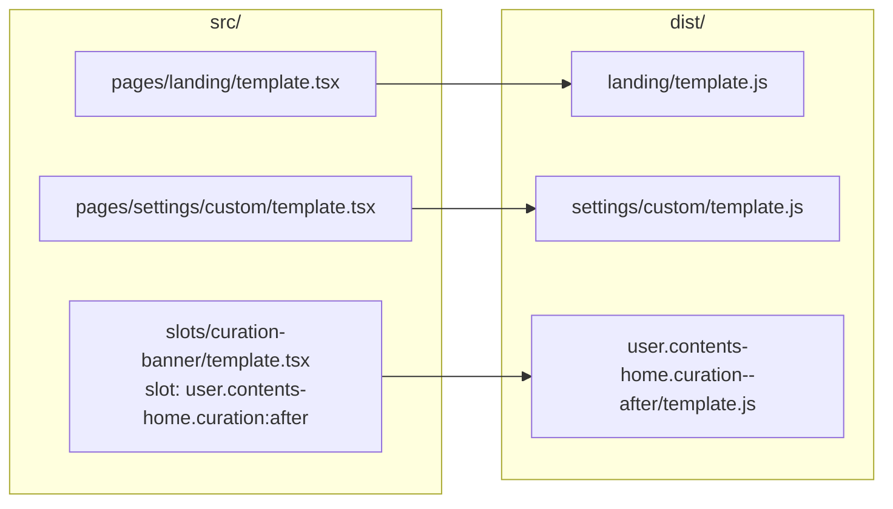

# bstage Template SDK 빌드 시스템

## 1. bstage build 개요

`bstage build`는 `src/pages/`·`src/slots/` 아래의 `template.tsx`를 탐색하여 IIFE 번들(`template.js`)을 생성합니다.

**산출물이 어디로 나가는지는 소스 위치가 정합니다.**



|        | 소스 위치                            | 배치를 정하는 것               | 산출물                       |
| ------ | ------------------------------------ | ------------------------------ | ---------------------------- |
| 페이지 | `src/pages/{경로}/template.tsx`      | 폴더 구조                      | `dist/{경로}/template.js`    |
| 위젯   | `src/slots/{아무 이름}/template.tsx` | `createTemplate`의 `slot` 옵션 | `dist/{슬롯 id}/template.js` |

위젯 산출물 디렉토리는 슬롯 id의 콜론을 `--`로 바꾼 이름입니다 — 콜론은 Windows에서 폴더 이름에 쓸 수 없습니다. 되돌리는 규칙은 core의 `slotIdToDirName` / `dirNameToSlotId`가 소유하며, 관리도구도 같은 함수를 씁니다.

**빌드 파이프라인:**

1. **템플릿 탐색** — `src/pages/`·`src/slots/`를 순회하며 `template.tsx`를 찾습니다. 두 기준 디렉토리 밖은 보지 않습니다 — 폴더 경로가 배포 경로가 되므로 어디서부터 세는지가 정해져 있어야 합니다.
2. **메타데이터 추출** — `metaPlugin`이 소스 코드에서 `createTemplate()` 호출의 옵션 객체를 파싱 (name, slot, type 등). name은 Custom Element 스펙상 소문자 시작 + 하이픈 1개 이상 + 소문자/숫자/하이픈만 허용
3. **Vite 빌드** — IIFE 포맷, React 런타임 포함, CSS를 JS에 인라인, 코드 스플릿 없음
4. **산출물 배치** — 위 표대로 `dist/` 아래로 옮깁니다 (아래 "빌드가 막는 것" 참조)
5. **인증 값 점검** — 번들에 인라인된 `VITE_BSTAGE_*` 값이 온전한지 확인 (아래)

### 빌드가 막는 것

`bstage build`는 `tsc`를 타지 않으므로 타입으로 막았다고 여긴 것이 여기까지 도달합니다. 위치와 옵션이 어긋나면 빌드가 끊습니다.

- `src/pages/` 아래인데 `slot` 옵션이 있음 — 위젯을 페이지 자리에 둔 경우
- `src/slots/` 아래인데 `slot` 옵션이 없음 — 위치만으로는 어느 자리인지 알 수 없음
- `slot` 값이 카탈로그(`SLOT_CATALOG_V2`)에 없음 — 후보를 함께 보여줍니다
- 두 템플릿의 산출물 위치가 겹침
- 두 템플릿의 Custom Element 태그명이 겹침 — 같은 페이지에 함께 로드되면 먼저 등록된 쪽만 살아남아 나중 템플릿이 조용히 앞 템플릿을 그립니다
- 페이지 폴더 이름이 `[id]` 형태 — **동적 경로는 아직 지원하지 않습니다**

`dist/`는 빌드 시작 시 통째로 비웁니다. 폴더를 옮기거나 지운 뒤 다시 빌드해도 옛 산출물이 남지 않습니다.

### 인증 값 점검

Vite 빌드라서 `import.meta.env.VITE_BSTAGE_*`는 **빌드 시점에 문자열로 치환**됩니다. `.env`가 없거나 값이 자리표시자면 그 상태가 그대로 번들에 박히고, 배포 후 401로만 드러납니다. 빌드 시점이 이를 잡을 수 있는 마지막 지점이라 여기서 점검합니다.

- **대상 판정** — 두 조건을 모두 만족할 때만 점검합니다.
  1. 번들에 BstageClient의 앱 ID 헤더(`X-BSTAGE-APP-ID`)가 있을 것. API를 쓰지 않는 UI 전용 템플릿은 `client.ts`를 스캐폴드만 하고 import하지 않으면 트리셰이킹으로 사라지므로 대상이 아닙니다.
  2. 소스가 `import.meta.env.VITE_BSTAGE_*`를 참조할 것. cli 0.40.1 이전 스캐폴드처럼 `client.ts`에 키를 리터럴로 박은 프로젝트는 `.env`가 없는 게 정상이므로(그 전환은 마이그레이션에서 `선택`) 대상이 아닙니다. 참조한 변수만 검사합니다.
- **검사 항목** — 값 누락, 자리표시자(`YOUR_APP_ID` 등) 잔존, appId·appSecret 뒤바뀜, 접두사(`bsa_`/`bsp_`) 불일치
- **env 해석** — Vite의 `loadEnv`를 그대로 씁니다. `.env` 파일뿐 아니라 CI가 `process.env`로 주입한 값도 번들에 인라인되므로 파일만 읽으면 오탐이 납니다.
- **빌드를 실패시키지 않습니다** — 값이 비어도 번들 자체는 정상적으로 나오고, 여기서 실패시키면 기존 소비자 CI가 깨집니다. 경고는 빌드 로그 맨 끝에 출력됩니다.
- 어느 환경에서 발급한 키인지(QA 키를 리얼에 썼는지)는 **감지할 수 없습니다** — 키 형식에 발급 환경이 담기지 않습니다. 그 계열은 [GETTING_STARTED.md](./GETTING_STARTED.md) "9.2 배포 전 점검"의 체크리스트가 담당합니다.

---

## 2. Vite 프리셋

```typescript
build: {
  lib: {
    formats: ['iife'],
    name: 'BstageTemplate',
    fileName: () => 'template.js',
  },
  cssCodeSplit: false,                           // CSS를 하나의 에셋으로 모음 (아래 주의 참조)
  rollupOptions: {
    output: { inlineDynamicImports: true },      // 단일 파일 출력
  },
}
```

**각 설정의 근거:**

| 설정                   | 값                                            | 근거                                                                                       |
| ---------------------- | --------------------------------------------- | ------------------------------------------------------------------------------------------ |
| `formats`              | `['iife']`                                    | `<script>` 태그로 직접 로드. 모듈 시스템 불필요                                            |
| `name`                 | `'BstageTemplate'`                            | IIFE 전역 변수명 (실제로는 side-effect로 Custom Element 등록)                              |
| `fileName`             | `'template.js'`                               | 고정 파일명. 호스트는 이 경로를 그대로 로드합니다                                          |
| `cssCodeSplit`         | `false`                                       | CSS를 한 덩어리로 모읍니다. **JS에 인라인되지는 않습니다** — 아래 "CSS는 어떻게 넣나" 참조 |
| `inlineDynamicImports` | `true`                                        | 단일 JS 파일로 출력. CDN에서 1회 로드로 완결                                               |
| `resolve.dedupe`       | `['react', 'react-dom', 'react/jsx-runtime']` | npm link 시 SDK 내부의 React와 템플릿 프로젝트의 React가 각각 번들되는 것을 방지           |

---

### CSS는 어떻게 넣나

템플릿은 Shadow DOM에 마운트되므로 바깥 스타일시트가 적용되지 않습니다. **CSS가 Shadow DOM 안으로 들어가는 경로는 둘뿐입니다.**

| 방법                                   | 배포 산출물 | 로컬 `npm run dev` |
| -------------------------------------- | ----------- | ------------------ |
| `createTemplate`의 `styles` 옵션       | **적용**    | 안 됨              |
| 컴포넌트 안 `<style>{cssText}</style>` | **적용**    | 적용               |
| `import './x.css'`                     | **안 됨**   | 적용               |

```tsx
import css from './style.css?inline'

createTemplate(MyTemplate, { name: 'my-space-hello', styles: css })
```

> **`import './x.css'`는 배포 산출물에서 조용히 사라집니다.** `cssCodeSplit: false`라 Vite가 CSS를 JS에 인라인하지 않고 **별도 `.css` 에셋**으로 내는데(`dist/.staging/{프로젝트}.css`), 빌드는 스테이징에서 `template.js` 하나만 최종 위치로 옮깁니다. 로컬 개발 화면에서는 적용되므로 **"로컬에선 되는데 배포하면 스타일이 없다"**로 나타납니다. CSS 파일로 관리하고 싶다면 `?inline`으로 문자열을 가져와 위 두 경로 중 하나로 넘기세요.

---

## 3. 호스트가 Custom Element 태그명을 아는 법

번들을 로드한 호스트는 `document.createElement(태그명)`으로 마운트해야 하는데, 관리도구는 `templateUrl` 하나만 내려줍니다. 그래서 **번들이 로드되면서 스스로 태그명을 알립니다.**

- 등록 시점(`registerTemplate`)에 `document.currentScript.src`(자기 번들 URL)와 태그명을 전역 `__bstage_elements__`에 남깁니다.
- `document.currentScript`는 스크립트가 동기 실행되는 동안만 유효한데, 템플릿 등록은 IIFE 최상위에서 일어나므로 이 시점에 자기 URL을 알 수 있습니다.
- URL을 키로 씁니다 — `loadTemplatesBySlots`는 여러 번들을 동시에 로드하므로 "로드 전후 증가분"으로 세면 서로 섞입니다.
- `loadTemplate`이 로드 직후 이 값을 조회합니다.
- 조회에 실패하면 **옛 번들 폴백**을 탑니다. 옛 산출물은 디렉토리 이름이 곧 태그명이었으므로(`dist/{name}/`) URL의 디렉토리 세그먼트를 후보로 삼되, 추측으로 쓰지 않고 `customElements.get()`으로 실제 등록됐는지 확인합니다. 확인까지 실패하면 던집니다. 옛 번들이 전부 재배포되면 걷어낼 수 있습니다.

> 예전에는 `manifest.json`이 이 값을 날랐습니다. 실어 나르던 정보가 태그명 하나뿐이었고 `entry`는 늘 `template.js`로 고정이라 파일을 없앴습니다. 함께 담기던 `sdkVersion`·`framework`·`type`은 호스트가 쓰지 않던 값입니다.

`spaceId` / `type`(user·admin) / `tag`(버전) 같은 상위 경로 세그먼트는 관리도구가 CDN 업로드 단계에서 주입하며, SDK는 관여하지 않습니다. 슬롯 배치와 풀페이지 레이아웃은 관리도구가 소유합니다.

---

## 4. 빌드 산출물 구조

```
dist/
  landing/
    template.js                              ← 페이지 /landing
  settings/
    custom/
      template.js                            ← 페이지 /settings/custom
  user.contents-home.curation--after/
    template.js                              ← 위젯
```

`template.js`는 IIFE 번들 하나입니다(React 런타임 + 컴포넌트 + CSS 인라인).

페이지 산출물은 경로만큼 중첩됩니다 — 단일 계층이 아닙니다. `spaceId` / `type`(user·admin) / `tag`(버전) 등 상위 경로 세그먼트는 관리도구가 CDN 업로드 시점에 주입하며, SDK는 관여하지 않습니다.

---

## 관련 문서

- [GETTING_STARTED.md](./GETTING_STARTED.md) — 빠른 시작 가이드 (빌드 및 배포 포함)
- [SDK_ARCHITECTURE.md](./SDK_ARCHITECTURE.md) — 단일 번들 출력 설계 원칙
- [DEV_SERVER.md](./DEV_SERVER.md) — 로컬 개발 서버 (빌드 없이 개발)
- [API_REFERENCE.md](./API_REFERENCE.md) — Host 패키지의 loadTemplate 시그니처
