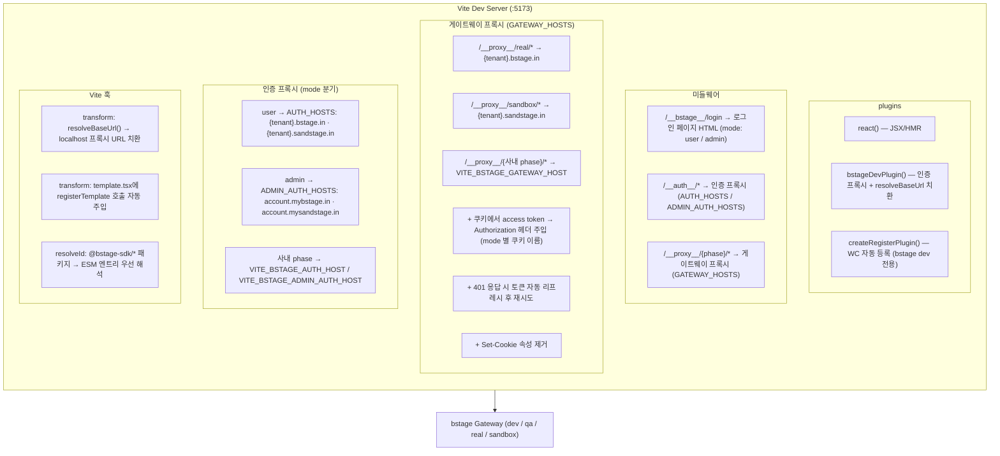
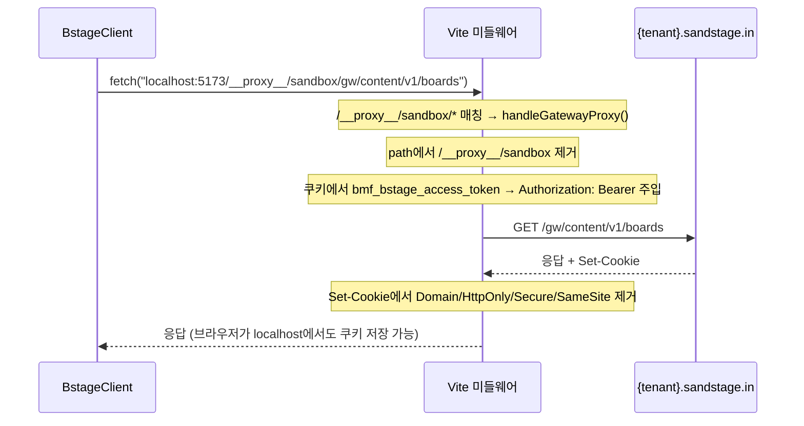
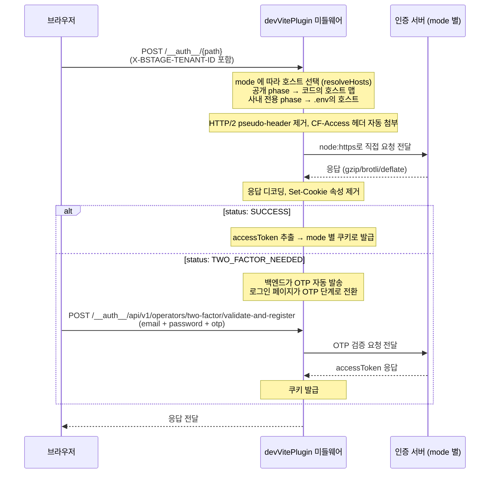
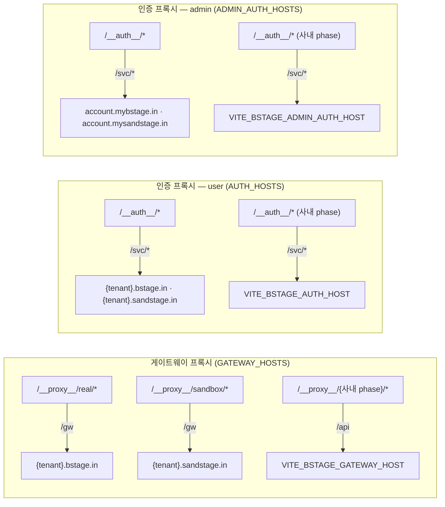
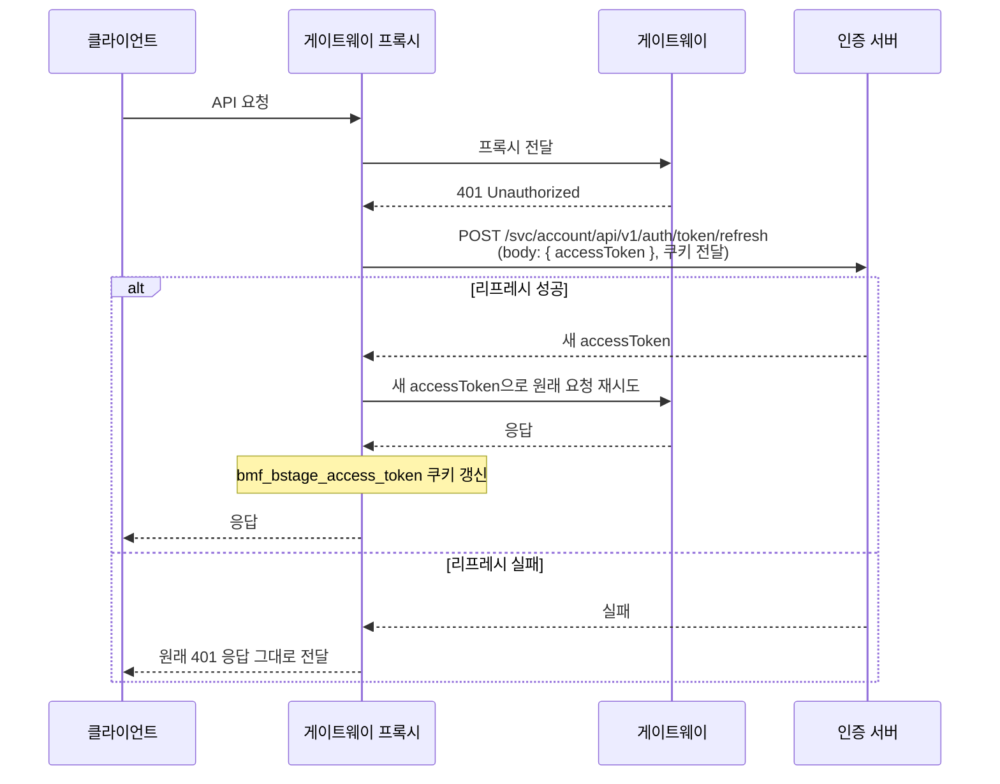
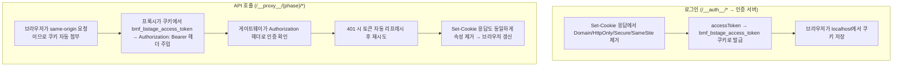

# bstage dev — 로컬 개발 서버

## 1. 개요

`bstage dev`는 Vite 개발 서버에 인증 프록시를 내장하여, 로컬에서도 b.stage API를 인증된 상태로 호출할 수 있게 합니다. 별도 프록시 서버 없이 Vite 플러그인 미들웨어 하나로 동작합니다.

**왜 프록시가 필요한가:** b.stage gateway는 인증 토큰을 httpOnly 쿠키로 관리합니다. 프로덕션에서는 동일 도메인이므로 쿠키가 자동 첨부되지만, localhost에서는 도메인이 달라 쿠키가 전달되지 않습니다. 인증 프록시가 이 문제를 해결합니다.

---

## 2. 아키텍처



### 구성 요소

| 구성 요소      | 파일                     | 역할                                                                                           |
| -------------- | ------------------------ | ---------------------------------------------------------------------------------------------- |
| devVitePlugin  | `dev/devVitePlugin.ts`   | 프록시, 쿠키 처리, 로그인, resolveBaseUrl 치환, Authorization 주입, 토큰 리프레시, ESM resolve |
| loginPage      | `dev/loginPage.ts`       | 로그인 페이지 HTML 생성                                                                        |
| registerPlugin | `vite/registerPlugin.ts` | template.tsx에 WC 등록 코드 자동 주입                                                          |
| Dev Command    | `commands/dev.ts`        | Vite 서버 생성 및 기동                                                                         |

---

## 3. 요청 흐름

### 3.1 resolveBaseUrl 치환

BstageClient는 `resolveBaseUrl()`으로 base URL을 결정합니다. 프로덕션에서는 `location.origin/gw`를 반환하지만, devVitePlugin이 Vite의 `transform` 훅에서 이 함수를 치환하여 localhost 프록시로 보냅니다.

```
// 원본 (bstage-core)
function resolveBaseUrl() {
  if (typeof globalThis.location !== 'undefined') return globalThis.location.origin + '/gw'
  return '/gw'
}

// 치환 후 (dev server 런타임, phase=sandbox 기준)
function resolveBaseUrl() { return "http://localhost:5173/__proxy__/sandbox/gw" }
```

이 치환은 Vite dev server의 transform 훅에서만 발생합니다. `bstage build`에는 이 플러그인이 포함되지 않으므로 프로덕션 빌드에는 영향이 없습니다.

### 3.2 API 호출 흐름

devVitePlugin의 phase가 `sandbox`로 설정된 경우:



### 3.3 인증 프록시 흐름 (`/__auth__/*`)

인증 모드(mode)에 따라 호스트·경로·발급 쿠키가 분기됩니다. 기본값은 `user`이며, 어드민 인증이 필요하면 `vite.config.ts`에서 `bstageDevPlugin({ mode: 'admin' })`으로 지정합니다. 로그인 페이지가 모드별 엔드포인트로 요청을 보냅니다.

| mode  | 인증 호스트 (real / sandbox)                     | 토큰 발급 경로                   | 발급 쿠키                         |
| ----- | ------------------------------------------------ | -------------------------------- | --------------------------------- |
| user  | `{tenant}.bstage.in` / `{tenant}.sandstage.in`   | `/svc/account/api/v1/auth/token` | `bmf_bstage_access_token`         |
| admin | `account.mybstage.in` / `account.mysandstage.in` | `/svc/api/v1/auth/token`         | `bmf_mybstage_admin_access_token` |

> **사내 전용 phase(`dev`·`qa`)의 호스트는 SDK에 들어 있지 않다.** 소비자가 `.env`의 `VITE_BSTAGE_AUTH_HOST`(user)·`VITE_BSTAGE_ADMIN_AUTH_HOST`(admin)로 공급한다 — 자세한 내용은 [5. 사용법](#5-사용법)의 "사내 전용 phase" 참조.



### 3.4 프록시 호스트 분리

게이트웨이 프록시와 인증 프록시가 서로 다른 호스트 매핑을 사용합니다. 인증 프록시는 mode(user/admin) 까지 추가로 분기합니다.



### 3.5 토큰 자동 리프레시

게이트웨이 프록시가 401 응답을 받으면 토큰 리프레시를 시도합니다.



---

## 4. 쿠키 처리 방식

유저 플랫폼의 **쿠키 속성 제거 패턴**을 채택. 서버 사이드 CookieStore 없이 브라우저에 쿠키 관리를 위임합니다.



---

## 5. 사용법

### bstage dev (CLI 독립 실행)

```json
{
  "scripts": {
    "bstage:dev": "bstage dev --phase dev"
  }
}
```

`configFile: false`로 동작하므로 사용자의 `vite.config.ts`와 충돌 없음.

### vite dev (사용자 Vite 설정에 플러그인 포함)

```ts
// vite.config.ts
import { bstageDevPlugin } from '@bstage-sdk/cli/vite'

export default defineConfig({
  plugins: [react(), bstageDevPlugin({ phase: 'sandbox' })],
})
```

사용자의 기존 Vite 설정에 플러그인만 추가. HMR, 기타 플러그인과 함께 동작.

### CLI 옵션

```
bstage dev [options]

Options:
  -p, --port <port>     Dev server port (기본: 5173)
  --phase <phase>       Target phase: dev, qa, real, sandbox
                        생략 시 .env의 VITE_BSTAGE_PHASE → 없으면 sandbox 순으로 정해집니다.
                        dev·qa는 사내 전용 — .env에 호스트와 CF Access 자격증명이 필요합니다.
```

> `bstage dev`는 파일 접근을 프로젝트 루트와 워크스페이스 루트로 제한합니다(`server.fs.strict`). 로컬 링크(`pnpm link`, `file:../`)로 개발해 의존 패키지의 실제 경로가 그 밖에 있다면 **스캐폴드의 `npm run dev`를 쓰세요** — 그쪽은 여러분의 `vite.config.ts`를 타므로 `server.fs.allow`를 직접 넣을 수 있습니다.

### 사내 전용 phase (`dev`·`qa`)

`real`·`sandbox`는 공개 서비스라 호스트가 SDK 안에 있어 설정 없이 동작합니다. **`dev`·`qa`는 사내 환경이라 호스트가 SDK에 들어 있지 않습니다** — 패키지 번들과 소스맵에 그대로 실려 나가기 때문입니다. 사내에서 이 phase로 개발하려면 `.env`에 다음을 채웁니다(값은 사내 문서 참조).

```
VITE_BSTAGE_GATEWAY_HOST=      # 게이트웨이
VITE_BSTAGE_AUTH_HOST=         # 유저 인증 (유저 템플릿)
VITE_BSTAGE_ADMIN_AUTH_HOST=   # 어드민 인증 (어드민 템플릿)

VITE_CF_ACCESS_CLIENT_ID=      # 게이트가 Cloudflare Access라 함께 필요
VITE_CF_ACCESS_CLIENT_SECRET=
```

셸 환경변수를 `.env`보다 먼저 봅니다(CI 주입 우선). 값이 없으면 **dev 서버가 뜨지 않고** 어떤 키가 비었는지 알려줍니다 — 호스트가 없으면 요청 자체를 만들 수 없어, 뜬 뒤에 실패하면 원인을 찾기 어렵기 때문입니다. 쓰지 않는 인증 호스트는 채우지 않아도 됩니다(유저 템플릿은 `VITE_BSTAGE_AUTH_HOST`만 봅니다).

### 개발자가 접근하는 URL

| URL                                      | 용도            |
| ---------------------------------------- | --------------- |
| `http://localhost:5173`                  | 개발 서버 (HMR) |
| `http://localhost:5173/__bstage__/login` | 로그인          |

### 디자인 토큰 fallback (bstage 톤 미리보기)

`@bstage-sdk/design` 토큰(`var(--user-mode-*)` 등)은 값을 담지 않고 **이름만** 참조한다 — 배포 시엔 플랫폼이 `:root`에 깔아둔 실제 값을 상속하지만, 개발 중엔 그 플랫폼이 없다. 그래서 `bstage dev`는 개발 호스트 페이지의 `:root`에 **fallback CSS를 자동 주입**해 로컬에서도 bstage 톤이 보이게 한다.

- `transformIndexHtml`(dev serve 전용)에서 `@bstage-sdk/design`의 `renderCss()`를 `<style>`로 주입. 유저/어드민은 **`package.json`의 `bstage.target`으로 판별**한다 — `admin`이면 `--admin-mode-*`(light 전용), 아니면 `--user-mode-*`(light+dark).
- **프로덕션 미포함**: `bstage build`는 이 훅을 거치지 않고, dev 훅도 `ctx.server`(serve)에서만 동작해 빌드 산출물엔 절대 들어가지 않는다.
- 유저 대상엔 우하단에 **라이트/다크 토글 버튼**(dev 전용)이 뜬다 — `<html data-bspoke>`를 바꿔 fallback의 다크 모드를 미리본다. 어드민은 light 전용이라 토글이 없다.

### sandbox phase + Cloudflare WARP (TLS 인증서)

`bstage dev --phase sandbox`에서 게이트웨이 호출이 아래처럼 **502**로 실패한다면:

```
{"message":"Gateway proxy error","error":"Proxy request failed: {space}.sandstage.in/gw/... — self-signed certificate in certificate chain"}
```

**원인은 SDK가 아니라 로컬 Cloudflare WARP(Zero-Trust)입니다.** WARP가 `*.sandstage.in` 트래픽을 TLS 인스펙션(MITM)하면서 인증서를 자체 CA(`Gateway CA - Cloudflare Managed G1`)로 재서명합니다. macOS 키체인은 이 CA를 신뢰하지만(그래서 브라우저·`curl`은 정상), **Node.js는 OS 키체인이 아닌 자체 내장 CA 목록만** 보기 때문에 "모르는 CA = self-signed"로 간주해 거부합니다.

> 사내 전용 phase(`dev`·`qa`)의 게이트웨이는 정식 인증서라 WARP 인스펙션 대상이 아닙니다. 그래서 **이 문제는 `sandbox`(그리고 어드민 `mysandstage.in`)에서만** 나타납니다.

**해결 — WARP CA를 Node 신뢰 목록에 추가** (TLS 검증을 끄지 말 것):

```bash
# 1) WARP CA를 키체인에서 PEM으로 추출
mkdir -p ~/.config/certs
security find-certificate -a -c "Gateway CA" -p /Library/Keychains/System.keychain \
  > ~/.config/certs/cloudflare-warp-ca.pem

# 2) Node가 이 CA를 신뢰하도록 환경변수 등록 (셸 프로파일에 영구 반영)
echo 'export NODE_EXTRA_CA_CERTS="$HOME/.config/certs/cloudflare-warp-ca.pem"' >> ~/.zshrc
source ~/.zshrc

# 3) 검증 (cert 에러 없이 상태코드가 찍히면 성공)
node -e "fetch('https://YOUR_SPACE.sandstage.in/gw/').then(r=>console.log('OK',r.status)).catch(e=>console.log('ERR',e.cause?.code||e.message))"
```

- `security ... -c "Gateway CA"`가 매치하지 않으면 `-c "Cloudflare"`로 검색하거나, 키체인 접근에서 인증서 이름을 직접 확인한다.
- **`NODE_TLS_REJECT_UNAUTHORIZED=0`은 쓰지 말 것** — 모든 TLS 검증을 꺼버려 위험하다. 위 방식은 WARP CA만 신뢰 목록에 *추가*하므로 안전하다.
- 이 설정은 **각 개발자 로컬에만** 적용된다(레포·SDK에 반영되지 않음). WARP를 쓰는 팀원은 각자 1회 수행한다.

---

## 6. 파일 구조

```
packages/cli/src/
  index.ts                   ← CLI 명령어 등록 (build, dev, init)
  commands/
    build.ts                 ← 빌드 명령어
    dev.ts                   ← Vite 서버 생성 및 기동
    init.ts                  ← 프로젝트 스캐폴딩
  dev/
    devVitePlugin.ts         ← Vite 플러그인 (프록시, 쿠키, 로그인, URL 치환, 토큰 리프레시, ESM resolve)
    loginPage.ts             ← 로그인 페이지 HTML 생성
  vite/
    preset.ts                ← Vite 빌드 설정 프리셋 + bstageDevPlugin export
    metaPlugin.ts            ← 빌드 시 createTemplate 메타데이터 추출
    registerPlugin.ts        ← 빌드/dev 시 WC 등록 코드 자동 주입
```

---

## 관련 문서

- [GETTING_STARTED.md](./GETTING_STARTED.md) — 빠른 시작 가이드 (로컬 실행 포함)
- [SDK_ARCHITECTURE.md](./SDK_ARCHITECTURE.md) — BstageClient의 base URL 결정과 fetch 주입 설계
- [BUILD_SYSTEM.md](./BUILD_SYSTEM.md) — 프로덕션 빌드 파이프라인
- [INIT.md](./INIT.md) — `bstage init`이 생성하는 vite.config.ts와 .env 설정
