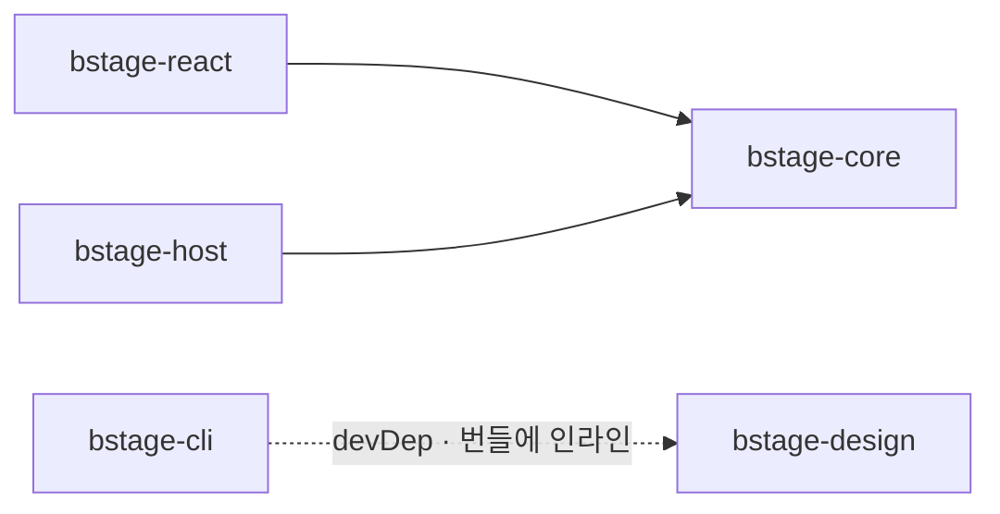
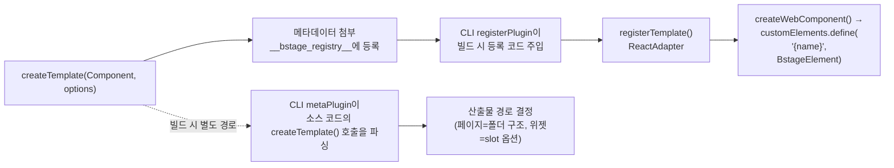
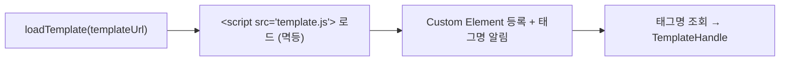
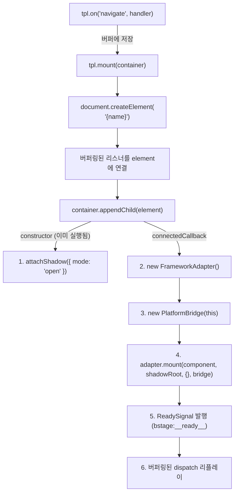
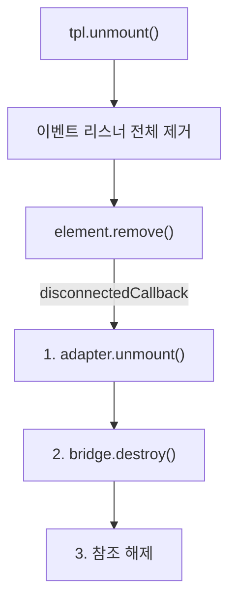

# bstage Template SDK 아키텍처

## 1. 개요

bstage Template SDK는 서드파티 개발 파트너가 React 등 모던 프레임워크로 템플릿을 작성하면, 이를 Web Component로 변환하여 bstage 플랫폼에 통합하는 개발 도구입니다.

서드파티는 Web Component를 직접 다루지 않습니다. 평소 프레임워크 개발과 동일한 방식으로 컴포넌트를 작성하고, SDK가 나머지를 처리합니다.

**설계 목표:**

- 서드파티 개발자가 플랫폼 내부 구현을 몰라도 템플릿을 개발할 수 있을 것
- 프레임워크 선택이 SDK에 의해 제한되지 않을 것
- 서드파티 코드가 플랫폼의 스타일이나 동작을 오염시키지 않을 것
- 빌드 산출물이 단일 JS 파일로 완결되어 배포와 로드가 단순할 것

---

## 2. 설계 원칙

### 프레임워크 독립성

Core는 특정 프레임워크에 의존하지 않습니다. `FrameworkAdapter` 인터페이스를 정의하고, 각 프레임워크 바인딩(React, Vue 등)이 이를 구현합니다. 새 프레임워크를 지원할 때 Core를 수정할 필요가 없습니다.

### 스타일 격리

Shadow DOM을 사용하여 서드파티 CSS가 플랫폼 UI에 영향을 주거나, 플랫폼 CSS가 템플릿을 깨뜨리는 것을 방지합니다. CSS는 빌드 시 JS 번들에 인라인되어 Shadow DOM 내부에서만 적용됩니다.

### 단일 번들 출력

템플릿은 하나의 IIFE JS 파일로 빌드됩니다. 코드 스플릿, 외부 의존성 참조, 별도 CSS 파일이 없어 CDN에서 한 번의 로드로 완결됩니다. 이는 기존 Liquid 파이프라인(.liquid → 파싱 → HTML 삽입)을 .js → 로드 → DOM 추가로 자연스럽게 대체합니다.

### 명시적 통신 경계

서드파티 코드와 플랫폼 사이의 모든 통신은 PlatformBridge를 통한 CustomEvent로 이루어집니다. 직접적인 DOM 접근이나 전역 상태 공유 없이, 정의된 이벤트 인터페이스를 통해서만 상호작용합니다.

### 토큰 비노출

서드파티 코드에서 플랫폼 사용자의 인증 토큰에 직접 접근하지 않습니다. API 호출은 BstageClient를 통해 `appId`/`appSecret` 기반으로 이루어집니다.

---

## 3. 기술 선택 근거

|                   | Web Components     | iframe + postMessage | Module Federation    |
| ----------------- | ------------------ | -------------------- | -------------------- |
| 프레임워크 자유도 | 완전 자유          | 완전 자유            | 동일 프레임워크 권장 |
| 스타일 격리       | Shadow DOM         | 완전 격리            | 없음 (충돌 가능)     |
| 보안 격리         | 중간               | 최고 (샌드박스)      | 낮음                 |
| 성능              | 좋음               | iframe 오버헤드      | 가장 좋음            |
| 양방향 통신       | CustomEvent (동기) | postMessage (비동기) | 직접 호출            |
| 제출물            | JS 번들 1개        | HTML + JS (독립 앱)  | 빌드 설정 맞춤 필요  |

1. **기존 Liquid 파이프라인과 가장 유사** — `.liquid` 로드 → 파싱 → HTML 삽입이 `.js` 로드 → 태그 생성 → DOM 추가로 자연스럽게 대체됩니다.
2. **브라우저 네이티브 표준** — Custom Elements + Shadow DOM은 W3C 표준이며 모든 모던 브라우저에서 별도 라이브러리 없이 동작합니다.
3. **Shadow DOM 스타일 격리** — 서드파티 CSS가 플랫폼 UI에 영향을 주거나 그 반대 상황을 자연스럽게 방지합니다.

---

## 4. 시스템 구조

### 패키지 구성

```
bstage-sdk/
├── packages/
│   ├── core/        @bstage-sdk/core
│   ├── react/       @bstage-sdk/react
│   ├── host/        @bstage-sdk/host
│   ├── cli/         @bstage-sdk/cli
│   └── design/      @bstage-sdk/design
└── (pnpm workspaces 모노레포)
```

각 패키지는 독립 버전으로 배포됩니다. 현재 버전은 각 `package.json`을 참조하세요.

### 의존 관계



`cli`는 `design`을 devDependency로 두고 **번들에 인라인**합니다. `bstage dev`가 로컬에 진짜 플랫폼이 없는 상태에서 `:root` 디자인 토큰 fallback을 깔아주기 때문에, 소비자가 `design`을 설치하지 않았어도 동작해야 합니다. dev 서버 전용이라 프로덕션 빌드 산출물에는 들어가지 않습니다.

### 레이어와 경계

| 레이어                | 패키지 | 사용자   | 역할                                                                              |
| --------------------- | ------ | -------- | --------------------------------------------------------------------------------- |
| **런타임 코어**       | core   | SDK 내부 | Web Component 팩토리, 이벤트 브릿지, 프레임워크 어댑터 인터페이스, API 클라이언트 |
| **프레임워크 바인딩** | react  | 서드파티 | 프레임워크별 어댑터 구현 + 개발자 API (createTemplate, hooks)                     |
| **플랫폼 통합**       | host   | 플랫폼   | 템플릿 로드 → 라이프사이클 관리 (mount/unmount)                                   |
| **빌드 도구**         | cli    | 서드파티 | Vite 기반 IIFE 번들 생성 + 산출물 경로 배치, 로컬 개발 서버                       |
| **디자인 토큰**       | design | 서드파티 | 색·타이포·그림자 토큰 (`./user`·`./admin` 서브패스 + css 산출물)                  |

Core는 프레임워크 바인딩과 플랫폼 통합 양쪽에서 사용되지만, 서드파티에게 직접 노출되지 않습니다. 서드파티는 React 바인딩의 API만 사용하고, 플랫폼은 Host SDK의 API만 사용합니다.

**어드민 템플릿도 같은 패키지·같은 명령을 씁니다.** 갈리는 것은 템플릿이 선언하는 `target`뿐이며, 런타임 등록 경로와 어댑터는 하나입니다. 다만 **어드민 API 호출 경로는 아직 없습니다** — `BstageClient`는 게이트웨이(유저단)만 지원하고, 어드민용 게이트웨이는 열리지 않았습니다. 자세한 내용은 [GETTING_STARTED.md](./GETTING_STARTED.md)의 "어드민 템플릿" 절을 참조하세요.

---

## 5. 핵심 추상화

### 5.1 FrameworkAdapter

프레임워크별 렌더링 로직을 캡슐화하는 인터페이스입니다. Core는 이 인터페이스에만 의존하므로, 새 프레임워크 지원 시 Core 수정 없이 어댑터만 추가하면 됩니다.

**책임:** Shadow DOM 내에 프레임워크 루트를 생성하고, props 갱신과 정리를 처리합니다.

**확장 포인트:** 현재 React 어댑터가 구현되어 있으며, 동일 인터페이스로 Vue, Svelte, Vanilla JS 어댑터를 추가할 수 있습니다.

> API 시그니처는 [API_REFERENCE.md](./API_REFERENCE.md#11-frameworkadapter)를 참고하세요.

### 5.2 createWebComponent / BstageElement

FrameworkAdapter를 받아 Web Component(BstageElement)를 생성하는 팩토리입니다.

**BstageElement의 책임:**

- `constructor`에서 Shadow DOM 생성 (`attachShadow({ mode: 'open' })`)
- `connectedCallback`에서 어댑터와 브릿지 초기화, 렌더링 시작
- `disconnectedCallback`에서 어댑터/브릿지 정리 및 참조 해제

Custom Element 등록(`customElements.define`)은 BstageElement 자체가 하지 않고, 프레임워크 바인딩의 `registerTemplate()`이 처리합니다. `createTemplate()`은 메타데이터 첨부와 레지스트리 등록만 수행하며, 빌드 시 CLI의 `registerPlugin`이 `registerTemplate()` 호출 코드를 자동 주입합니다.

> API 시그니처는 [API_REFERENCE.md](./API_REFERENCE.md#12-createwebcomponent)를 참고하세요.

### 5.3 PlatformBridge

템플릿과 플랫폼 사이의 양방향 통신 채널입니다.

**통신 방향과 이벤트 전파 전략:**

| 방향                | 메서드        | bubbles | composed | 이유                                                               |
| ------------------- | ------------- | ------- | -------- | ------------------------------------------------------------------ |
| Template → Platform | `bridge.emit` | `true`  | `true`   | Shadow DOM 경계를 넘어 플랫폼의 이벤트 리스너에 도달해야 함        |
| Platform → Template | `bridge.on`   | `false` | `false`  | 해당 템플릿 요소에만 전달. 다른 템플릿이나 플랫폼 UI에 전파 불필요 |

`composed: true` 설계 근거: Shadow DOM 내부에서 발생한 이벤트는 기본적으로 Shadow 경계에서 멈춥니다. 템플릿이 플랫폼에 요청(네비게이션, 토스트 등)을 보내려면 이벤트가 Shadow 경계를 넘어야 하므로 `composed: true`가 필수입니다.

> 이벤트 목록과 페이로드 타입은 [API_REFERENCE.md](./API_REFERENCE.md#13-platformbridge)를 참고하세요.

### 5.4 BstageClient

파트너에게 공개된 API 접근을 제공하는 HTTP 클라이언트입니다.

**설계 의도:** 서드파티가 플랫폼 API를 호출할 때, 플랫폼 사용자의 인증 토큰 대신 `appId`/`appSecret`/`tenantId`를 사용합니다. 이로써 서드파티 코드가 사용자 토큰에 접근할 수 없으며, API 접근 범위를 앱 단위로 제어할 수 있습니다.

**base URL 결정:** `resolveBaseUrl()` 함수가 `location.origin/gw`를 반환하여 현재 호스트 기반으로 요청합니다. 로컬 개발 시에는 devVitePlugin이 이 함수를 치환하여 localhost 프록시로 라우팅합니다.

**커스텀 fetch 주입:** `globalThis.__bstage_fetch__`를 통해 플랫폼이 인증 헤더(Authorization, CF Access)를 포함하는 fetch를 주입할 수 있습니다. 이를 통해 템플릿이 플랫폼과 동일한 인증 컨텍스트로 API를 호출할 수 있습니다.

> API 시그니처와 사용 예시는 [API_REFERENCE.md](./API_REFERENCE.md#14-bstageclient)를 참고하세요.

---

## 6. 데이터 흐름

### 빌드타임



**등록 경로는 하나입니다.** 유저 템플릿과 어드민 템플릿이 같은 `registerTemplate()`·같은 `ReactAdapter`를 씁니다. 프로젝트의 `bstage.target`은 런타임을 가르지 않고 도구(디자인 토큰 fallback·에이전트 가이드)만 읽습니다.

### 런타임 — 로드



### 런타임 — 마운트



**dispatch 버퍼링:** `tpl.dispatch()`를 mount 직후에 호출하면 React 렌더링이 아직 완료되지 않아 이벤트가 유실될 수 있다. TemplateHandle은 템플릿이 `bstage:__ready__` 이벤트를 발행할 때까지 dispatch를 버퍼링하고, ready 후 순서대로 리플레이한다.

### 런타임 — 언마운트



### Shadow DOM 결과물

```html
<myspace-home>
  #shadow-root (open)
  <style>
    /* 빌드 시 인라인된 CSS */
  </style>
  <div>/* 프레임워크가 렌더링한 UI */</div>
</myspace-home>
```

---

## 7. 보안 모델

Shadow DOM은 **스타일 격리**이지 **보안 격리**가 아닙니다. JavaScript 실행 환경은 플랫폼과 공유됩니다.

| 위협            | 대응                                        |
| --------------- | ------------------------------------------- |
| 악성 코드 포함  | 번들 제출 시 정적 분석 (금지 API 패턴 탐지) |
| 플랫폼 DOM 조작 | CSP 헤더로 제한                             |
| 토큰/쿠키 탈취  | 민감 정보는 HttpOnly 쿠키로만 관리          |
| API 남용        | API Gateway에서 rate limiting               |

서드파티의 API 접근은 BstageClient를 통해 `appId`/`appSecret` 기반으로 이루어지며, 플랫폼 사용자의 인증 토큰에 직접 접근하지 않습니다.

---

## 관련 문서

- [GETTING_STARTED.md](./GETTING_STARTED.md) — 빠른 시작 가이드
- [API_REFERENCE.md](./API_REFERENCE.md) — 각 패키지의 public API 시그니처 상세
- [BUILD_SYSTEM.md](./BUILD_SYSTEM.md) — CLI 빌드 과정, Vite 설정, 산출물 경로 규칙
- [DEV_SERVER.md](./DEV_SERVER.md) — 로컬 개발 서버의 인증 프록시와 요청 흐름
- [INIT.md](./INIT.md) — `bstage init` 명령어 상세
