# 슬롯 카탈로그 v2

V2 슬롯의 **전체 목록·context 계약·소비 방법**과 **각 자리가 실제 화면 어디에 박히는지**를 한 문서에 정리한 카탈로그. 외부 템플릿 개발자가 "어떤 자리가 있고, 무슨 데이터를 받고, 어떻게 만들어 어디에 들어가는지"를 여기서 본다.

- 슬롯 시스템의 설계 원칙·키 구조·호스트/위젯 책임 경계는 [SLOT_PROTOCOL.md](./SLOT_PROTOCOL.md)가 다룬다. 이 문서는 그 약속 위의 **실제 자리 목록 + 시각 레퍼런스**다.
- 옛 v1 슬롯(4-part 키)은 [SLOT_CATALOG.md](./SLOT_CATALOG.md) 참고. v1 제거 시 이 문서가 정식 카탈로그가 된다.

## SSOT 및 타입

자리·context의 **단일 진실 원천**은 SDK(`@bstage-sdk/core`)의 `SLOT_CATALOG_V2` 객체(`packages/core/src/core/slotCatalogV2.ts`)다. 키 유니온·context 타입은 `as const` 추론으로 자동 파생된다(별도 codegen 없음).

```typescript
import {
  SLOT_CATALOG_V2,
  getSlotsByTargetV2,
  type SlotIdV2,
  type SlotContextOf,
} from '@bstage-sdk/core'

const userSlots = getSlotsByTargetV2('user') // 유저 플랫폼 자리 필터
const adminSlots = getSlotsByTargetV2('admin') // 어드민 플랫폼 자리 필터
const allIds = Object.keys(SLOT_CATALOG_V2) as SlotIdV2[]

type Ctx = SlotContextOf<'user.contents-detail.body:after'> // → { content: Content }
```

- `SlotIdV2` — 카탈로그에 등록된 슬롯 id 유니온. `<SlotWidget slotId>` 타입 검사에 쓰임.
- `getSlotsByTargetV2(target)` — `user`/`admin`별 자리 목록·`description` 라벨. 관리도구 picker가 사용.
- `SlotContextOf<Id>` — 자리별 context 객체 타입. 호스트의 `context` props와 위젯 `useSlotContext` 반환 타입이 이 타입으로 강제된다.

## 키 형식

`{target}.{page-or-app}.{anchor}` 3-part. 점(`.`)으로 부분 구분, 대시(`-`)로 단어 잇기, 콜론(`:`)으로 위치 modifier(`:before`·`:after`).

| 부분          | 값                                                                         |
| ------------- | -------------------------------------------------------------------------- |
| `target`      | `user`(유저 플랫폼) · `admin`(어드민 플랫폼)                               |
| `page-or-app` | 페이지 ID(`shop-home`·`digital-ticket-detail`) 또는 `app-{region}`         |
| `anchor`      | `{영역}:{before\|after}` (예: `body:after`·`form:after`·`comments:before`) |

전체 어휘·설계 근거는 [SLOT_PROTOCOL.md §3](./SLOT_PROTOCOL.md) 참고.

## context 계약

context는 **호스트 → 위젯 단방향 read-only**다. 호스트가 자리를 박을 때 한 번 공급하고, 위젯은 받아서 자기 안에서만 쓴다 — 위젯이 호스트로 데이터를 돌려보내는 통로는 없다.

- **SDK 기본 매핑**: 자리별 context 타입은 `SlotContextMap`(slotCatalogV2.ts)이 정의. 위젯은 `SlotContextOf<Id>`로 가져간다.
- **호스트 오버라이드**: 호스트가 자기 도메인 타입으로 덮어쓰려면 `SlotContextOverrides` declaration merging 사용.
- **context 없는 자리**: 목록·홈 성격의 자리(`*.list:before`·`*.feed:before`·`*.section:before` 등)는 context를 주지 않는다(아래 표 `context` 칸이 `—`).
- 공통 context(`spaceId`·`isLoggedIn` 등)는 SDK가 자동 주입하지 않고 **호스트가 직접 조립**해 넘긴다([SLOT_PROTOCOL.md §5](./SLOT_PROTOCOL.md)).

각 자리가 받는 도메인 타입은 아래 카탈로그 표의 `context` 칸에 명시한다.

## 소비 — 위젯 만들기

위젯은 `useSlotContext<Id>()`로 호스트가 공급한 context를 받는다. 반환 타입은 `SlotContextOf<Id>`.

```tsx
import { createTemplate, useSlotContext } from '@bstage-sdk/react'

function ContentBadge() {
  const ctx = useSlotContext<'user.contents-detail.body:after'>()
  if (!ctx) return null // ready 전 또는 호스트가 context 미공급
  return <Badge contentId={ctx.content.id} title={ctx.content.title} />
}

export default createTemplate(ContentBadge, {
  name: 'my-content-badge',
  slot: 'user.contents-home.curation:after',
})
```

- 위젯은 `src/slots/` 아래 두고 `slot`으로 자리를 선언한다. **한 위젯은 한 자리** — 같은 위젯을 여러 자리에 재사용할 수 없다.
- `bstage build`가 이 값을 카탈로그와 대조해 오타를 막고, 산출물을 `dist/{콜론을 `--`로 바꾼 자리 id}/`로 내보낸다. 관리도구은 그 이름을 되돌려 자리↔위젯 일치를 검증한다.
- 호스트 배선·관리도구 매핑 흐름은 [SLOT_PROTOCOL.md §6~8](./SLOT_PROTOCOL.md) 참고.

> **아래 도식에 대하여**
> 페이지의 세로 구성을 실제 화면 비율대로 그린 그림이다. **주황 테두리 박스가 슬롯 자리**이고, 그 안의 모노스페이스 텍스트가 슬롯 키, 오른쪽(좁으면 아래)이 호스트가 넘기는 context다(없으면 "context 없음"). 회색 블록은 플랫폼이 그리는 콘텐츠이며 자리와 크기만 나타낸다 — 카드 개수처럼 데이터에 따라 달라지는 것은 대표값이다. PC 기준이고 모바일도 섹션 순서는 같다. 그림은 `scripts/gen-slot-figures.mjs`가 만든다.

---

## 유저 (`target: user`)

### 콘텐츠 홈 — `/contents`

| 슬롯 키                                      | 위치                  | context |
| -------------------------------------------- | --------------------- | ------- |
| `user.contents-home.curation:after`          | 큐레이션 섹션 아래    | —       |
| `user.contents-home.contents-section:before` | 콘텐츠 섹션 묶음 위   | —       |
| `user.contents-home.contents-section:after`  | 콘텐츠 섹션 묶음 아래 | —       |

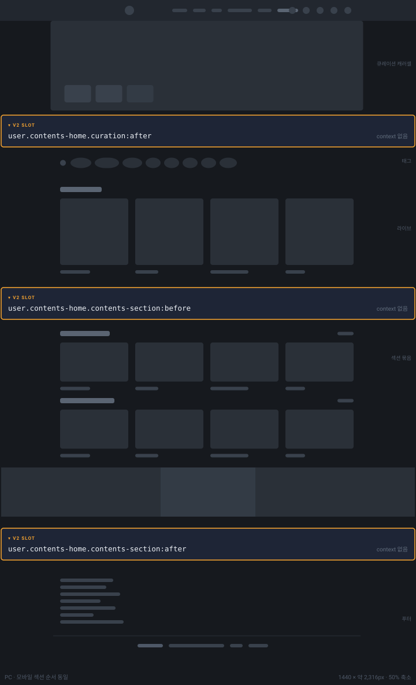

### 콘텐츠 상세 — `/contents/[id]`

포스트·미디어 두 렌더러가 같은 자리 키를 공유한다.

| 슬롯 키                                | 위치         | context            |
| -------------------------------------- | ------------ | ------------------ |
| `user.contents-detail.body:before`     | 본문 위      | `content: Content` |
| `user.contents-detail.body:after`      | 본문 아래    | `content: Content` |
| `user.contents-detail.comments:before` | 댓글 섹션 위 | `content: Content` |

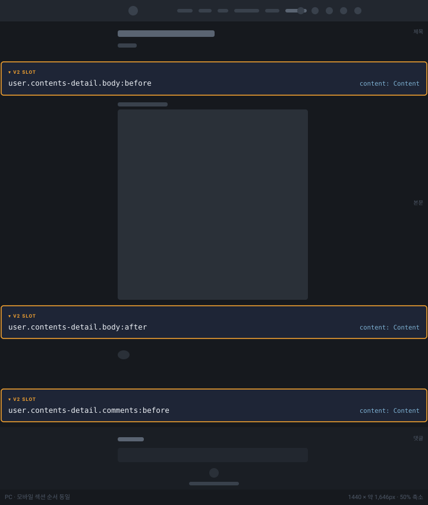

### 콘텐츠 큐레이션 목록 — `/contents/curation`

| 슬롯 키                              | 위치    | context |
| ------------------------------------ | ------- | ------- |
| `user.contents-curation.list:before` | 목록 위 | —       |

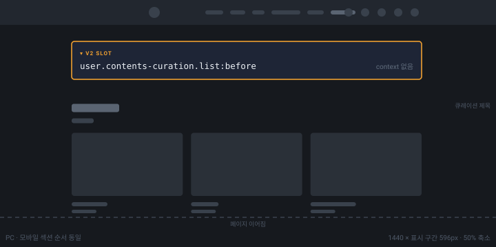

### 콘텐츠 섹션 목록 — `/contents/section/[id]`

| 슬롯 키                             | 위치    | context                        |
| ----------------------------------- | ------- | ------------------------------ |
| `user.contents-section.list:before` | 목록 위 | `section: ContentsSectionInfo` |

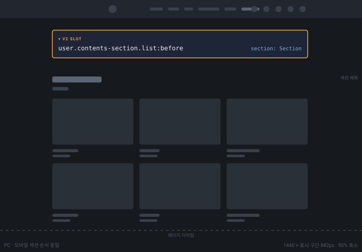

### 스토리 홈 — `/story/feed`

| 슬롯 키                       | 위치         | context |
| ----------------------------- | ------------ | ------- |
| `user.story-home.feed:before` | 피드 영역 위 | —       |

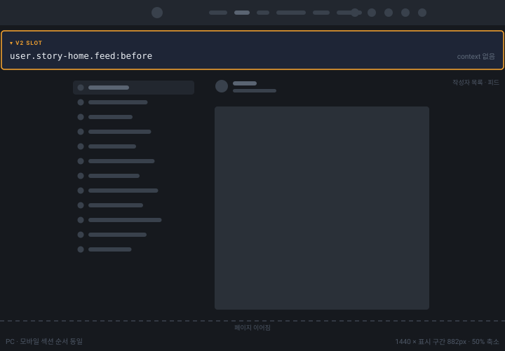

### 스토리 피드 상세 — `/story/feed/[id]`

| 슬롯 키                                  | 위치                     | context            |
| ---------------------------------------- | ------------------------ | ------------------ |
| `user.story-feed-detail.post:before`     | 포스트 영역 위           | `content: Content` |
| `user.story-feed-detail.comments:before` | 댓글 섹션 위 (본문 아래) | `content: Content` |

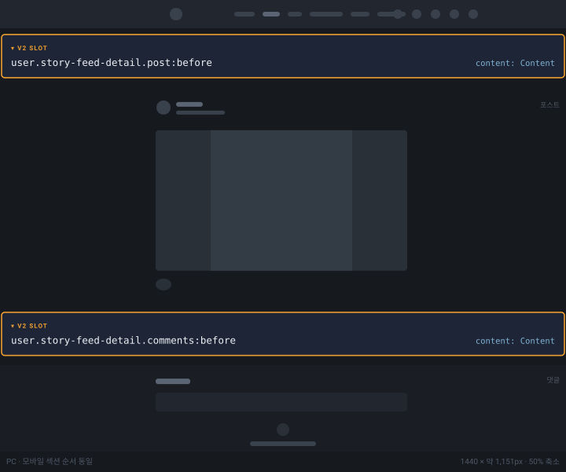

### POP 홈 — `/pop`

| 슬롯 키                     | 위치    | context |
| --------------------------- | ------- | ------- |
| `user.pop-home.list:before` | 목록 위 | —       |

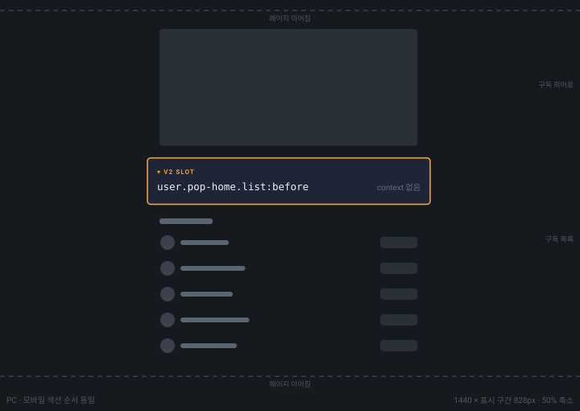

### 커뮤니티 게시판 — `/community` · `/community/board/[id]`

| 슬롯 키                            | 위치           | context            |
| ---------------------------------- | -------------- | ------------------ |
| `user.community-board.feed:before` | 게시판 피드 위 | `board: BoardInfo` |

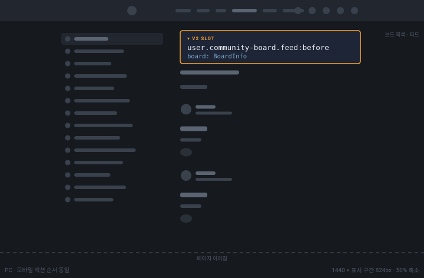

### 커뮤니티 포스트 상세 — `/community/board/[id]/post/[postId]`

| 슬롯 키                                      | 위치           | context               |
| -------------------------------------------- | -------------- | --------------------- |
| `user.community-post-detail.post:before`     | 포스트 영역 위 | `post: BoardPostInfo` |
| `user.community-post-detail.comments:before` | 댓글 섹션 위   | `post: BoardPostInfo` |

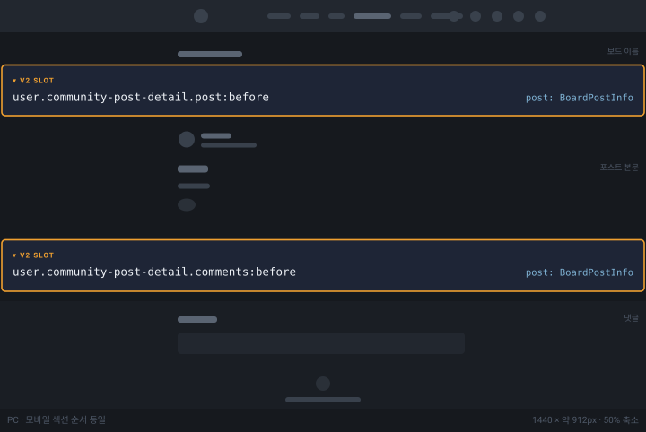

### 라운지 커뮤니티 — `/lounge/[loungeHandle]/community`

| 슬롯 키                             | 위치           | context            |
| ----------------------------------- | -------------- | ------------------ |
| `user.lounge-community.feed:before` | 게시판 피드 위 | `board: BoardInfo` |

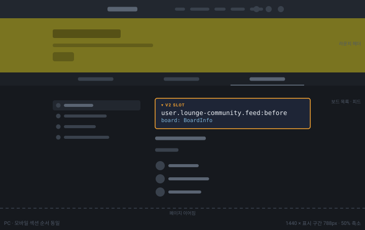

### 라운지 콘텐츠 — `/lounge/[loungeHandle]/contents`

| 슬롯 키                               | 위치         | context |
| ------------------------------------- | ------------ | ------- |
| `user.lounge-contents.section:before` | 섹션 묶음 위 | —       |

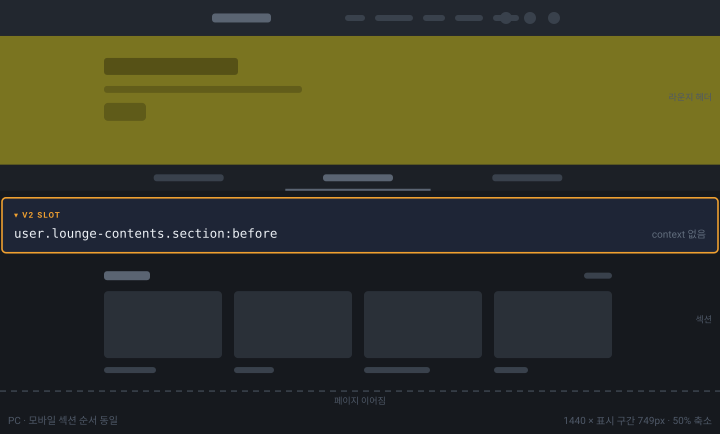

### 라운지 스토리 — `/lounge/[loungeHandle]/story`

| 슬롯 키                         | 위치         | context |
| ------------------------------- | ------------ | ------- |
| `user.lounge-story.feed:before` | 피드 영역 위 | —       |

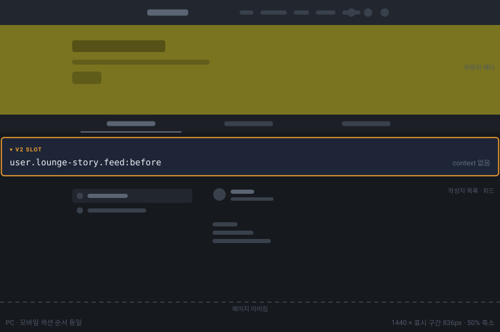

### 샵 홈 — `/shop`

| 슬롯 키                         | 위치           | context |
| ------------------------------- | -------------- | ------- |
| `user.shop-home.section:before` | 섹션 묶음 위   | —       |
| `user.shop-home.section:after`  | 섹션 묶음 아래 | —       |

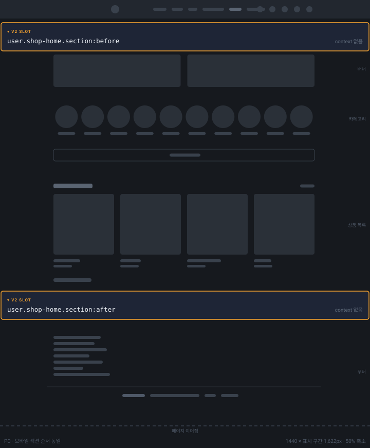

### 상품 상세 — `/shop/products/[productId]`

| 슬롯 키                            | 위치                | context            |
| ---------------------------------- | ------------------- | ------------------ |
| `user.product-detail.detail:after` | 상품 상세 본문 아래 | `product: Product` |

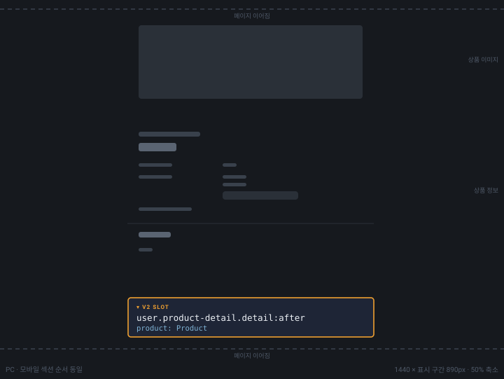

### 마이 홈 — `/my`

| 슬롯 키                    | 위치         | context |
| -------------------------- | ------------ | ------- |
| `user.my-home.menu:before` | 메뉴 목록 위 | —       |

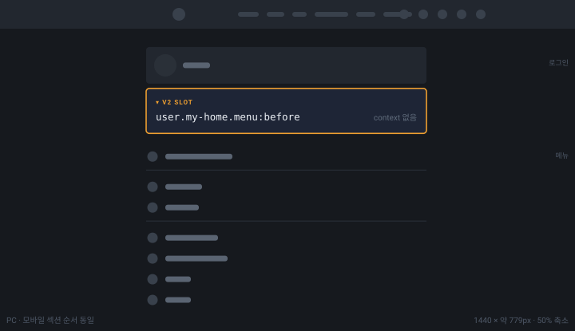

---

## 어드민 (`target: admin`)

### 디지털 티켓 상세 — 디지털 티켓 생성/수정

| 슬롯 키                                  | 위치                           | context                 |
| ---------------------------------------- | ------------------------------ | ----------------------- |
| `admin.digital-ticket-detail.form:after` | 디지털 티켓 상세 본문(폼) 아래 | `ticket: DigitalTicket` |

> 도식은 어드민 플랫폼 화면 실측이 필요해 아직 넣지 않았다(후속 보강). 키·context 계약은 위 표가 SSOT(`SLOT_CATALOG_V2`)와 일치한다.

---

## 버전 정책

자리 추가·context 타입 추가 같은 **순수 additive 변경은 patch** bump — `^0.x.y` caret 범위(같은 minor) 안에서 소비자가 재설치만으로 새 자리를 받는다. 기존 자리의 context 모양 변경·자리 제거·동작 변경은 minor 이상. 안정화(1.0) 이후 semver 표는 [SLOT_PROTOCOL.md §11](./SLOT_PROTOCOL.md) 참고.

## 관련 문서

- [SLOT_PROTOCOL.md](./SLOT_PROTOCOL.md) — 슬롯 시스템 설계·키 구조·context 계약·호스트/위젯/관리도구 책임 경계
- [API_REFERENCE.md](./API_REFERENCE.md) — `useSlotContext`·`createTemplate`·`TemplateHandle` 시그니처
- [SLOT_CATALOG.md](./SLOT_CATALOG.md) — 옛 v1 슬롯 목록(공존 기간 참조용)
