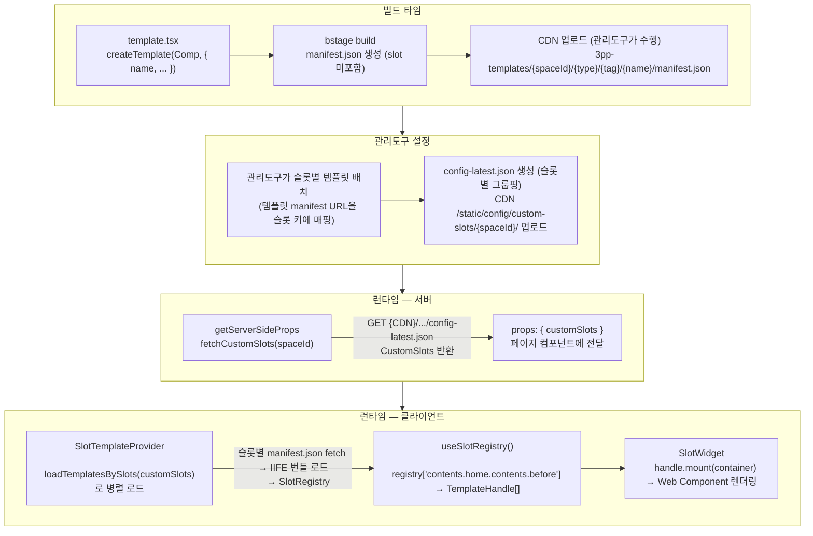
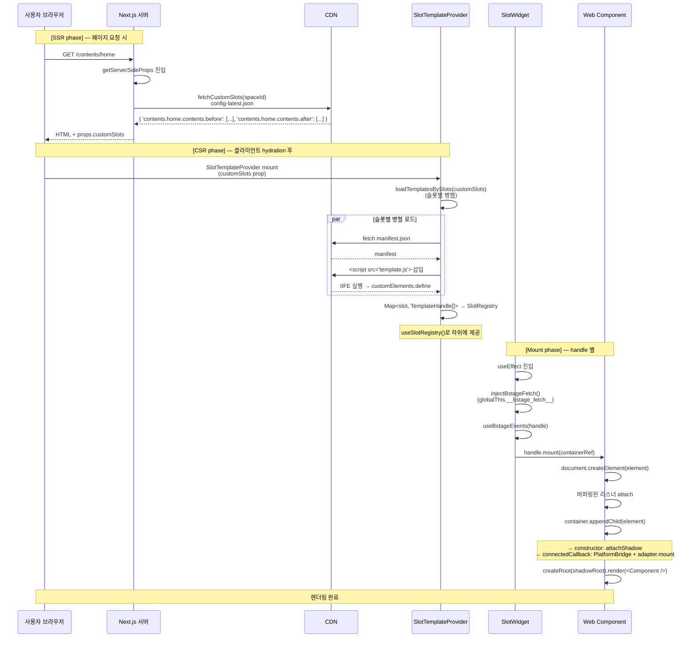

# Extension Slot 시스템

서드파티 템플릿을 플랫폼 UI의 특정 위치에 삽입하는 시스템.
풀페이지 템플릿과 달리, 기존 페이지 레이아웃 안에서 위젯 형태로 렌더링된다.

> **옛 설계 문서다.** 새 슬롯 모델은 [SLOT_PROTOCOL.md](./SLOT_PROTOCOL.md)·[SLOT_CATALOG_V2.md](./SLOT_CATALOG_V2.md)를 본다.
> 이 문서의 **소스 구조·빌드 산출물·`manifest.json` 설명은 더 이상 맞지 않는다** — `src/templates/`는 `src/pages/`·`src/slots/`로 갈렸고, manifest는 없어졌으며 산출물 경로도 바뀌었다.
> 현재 내용은 [BUILD_SYSTEM.md](./BUILD_SYSTEM.md)에 있다.

---

## 설계 방향

> "초반에 세밀한 틀을 만들면 복잡도가 무한히 증가 → 자유도를 열어주고 시작하는 게 나음"

- 페이지당 1~2개의 큰 슬롯만 제공 (삽입 전용, 기존 UI 대체 없음)
- 슬롯 안에서 개발자가 CSS로 자유롭게 구성
- 풀페이지 커스텀 DX를 우선하고, 슬롯은 점진적으로 확장

---

## 슬롯 목록

슬롯 목록, 네이밍 규칙, 이벤트 인터페이스, 슬롯별 `resourceId` 의미는 [SLOT_CATALOG.md](./SLOT_CATALOG.md)를 참고한다.

코드 SSOT는 `packages/core/src/core/slotCatalog.ts`의 `SLOT_CATALOG` 배열이다.

---

## 전체 흐름

템플릿 코드는 슬롯을 선언하지 않는다. 슬롯 배치는 관리도구가 결정하여 `config-latest.json`에 기록한다. `TemplateSlot` 타입은 유저 플랫폼이 슬롯 키를 타입 안전하게 다루기 위해 SDK에서 export된다.



---

## SDK 측 구현

### 1. 템플릿 선언

슬롯 전용 템플릿도 풀페이지 템플릿과 동일하게 선언한다. 슬롯 배치는 관리도구가 결정한다.

```tsx
// src/templates/my-space-my-widget/template.tsx
import { createTemplate } from '@bstage-sdk/react'
import MyWidget from './MyWidget'

export default createTemplate(MyWidget, {
  name: 'my-space-my-widget',
})
```

### 2. manifest.json 출력

```json
{
  "elementName": "my-space-my-widget",
  "entry": "template.js"
}
```

manifest에는 슬롯 정보가 포함되지 않는다. 같은 템플릿을 여러 슬롯에 배치하거나 재사용할 수 있다. 실제 런타임 슬롯 매핑은 관리도구가 작성한 `config-latest.json`이 결정한다.

---

## 유저 플랫폼 측 구현

### 1. 슬롯 설정 조회 — `fetchCustomSlots()`

```
GET {CDN_DOMAIN}/static/config/custom-slots/{spaceId}/config-latest.json
```

관리도구가 CDN에 업로드한 `config-latest.json`을 fetch하여 슬롯별 그룹핑된 설정을 반환한다.

### 2. SSR에서 Props 전달 — `getServerSideProps`

```typescript
// 플랫폼의 SSR props 조립부
const customSlots = await fetchCustomSlots(spaceId)
return { props: { customSlots } }
```

스페이스의 `enableCustomPages` 플래그가 `true`인 경우에만 슬롯 설정을 조회한다.

### 3. 로드 & 레지스트리 — `SlotTemplateProvider`

```
SlotTemplateProvider({ customSlots, children })
  └─ loadTemplatesBySlots(customSlots)로 슬롯별 병렬 로드
  └─ Map<string, TemplateHandle[]> → SlotRegistry 변환
  └─ SlotRegistry = { 'contents.home.contents.before': [handle, ...], 'contents.home.contents.after': [...] }
  └─ useSlotRegistry() 훅으로 하위 컴포넌트에 제공
```

### 4. 마운트 — `SlotWidget`

```tsx
<SlotWidget handle={templateHandle} />
```

- `injectBstageFetch()` — 플랫폼 인증 헤더 포함된 fetch 주입
- `useBstageEvents(handle)` — navigate, toast 등 이벤트 연결
- `handle.mount(container)` — Web Component를 DOM에 마운트
- unmount 시 cleanup 자동 처리

**fork + resourceId 패턴:**

같은 슬롯을 한 페이지 내 여러 위치에 독립적으로 마운트할 때 `handle.fork()`를 사용한다. `SlotWidget`은 `resourceId` prop을 받으면 내부에서 fork + `dispatch('slot.init', { resourceId })`를 자동 처리한다.

```tsx
// 주문 상세 — 티켓 항목마다 독립된 QR 뷰어 마운트
{
  orderItems.map((item) => (
    <SlotWidget key={item.productId} handle={handle} resourceId={item.productId} />
  ))
}
```

### 5. 페이지 통합 — `ContentHomeContainer`

```tsx
// 플랫폼의 콘텐츠 홈 컨테이너
const { registry } = useSlotRegistry();
const beforeHandles = registry['contents.home.contents.before'];
const afterHandles = registry['contents.home.contents.after'];

return (
  <>
    <Curation />
    <Tags />
    <ShowSection />

    {beforeHandles?.map((h, i) => <SlotWidget key={`before-${i}`} handle={h} />)}

    {contentSections.map(section => <ContentsSection ... />)}

    {afterHandles?.map((h, i) => <SlotWidget key={`after-${i}`} handle={h} />)}

    <Footer />
  </>
);
```

---

## 렌더링 시점 시퀀스

Slot 템플릿이 실제로 유저 플랫폼 안에서 렌더되는 시점을 단계별로 정리한다.

### 전체 시퀀스



### 시점 요약

| 단계                                       | 실행 컨텍스트      | 트리거                                                                |
| ------------------------------------------ | ------------------ | --------------------------------------------------------------------- |
| `fetchCustomSlots`                         | 서버 (Next.js SSR) | 페이지 요청                                                           |
| `SlotTemplateProvider` mount               | 클라이언트         | React hydration 직후                                                  |
| `loadTemplatesBySlots`                     | 클라이언트         | Provider mount의 useEffect                                            |
| `manifest.json` fetch + `template.js` 로드 | 클라이언트 (병렬)  | loadTemplatesBySlots 내부                                             |
| `customElements.define`                    | 클라이언트         | template.js IIFE 자동 실행                                            |
| `SlotWidget` mount                         | 클라이언트         | Provider가 SlotRegistry를 Context에 제공 후 ContentHomeContainer 렌더 |
| `injectBstageFetch`                        | 클라이언트         | SlotWidget useEffect                                                  |
| `handle.mount` → `connectedCallback`       | 클라이언트         | SlotWidget useEffect                                                  |
| Shadow DOM + React render                  | 클라이언트         | connectedCallback 내부                                                |

### 보장되는 순서

1. **같은 Slot 내 배열 순서**: `config-latest.json`에 명시된 배열 순서대로 렌더된다 (`map` 순서 = DOM 삽입 순서).
2. **이벤트 리스너 등록 시점**: `handle.on(...)`을 `mount()` 전에 호출하면 `TemplateHandle`이 버퍼링하여 mount 시 한 번에 attach한다. 마운트 직후 발행되는 이벤트도 누락되지 않는다.
3. **`__bstage_fetch__` 주입**: `handle.mount` **이전**에 주입되므로, 템플릿이 마운트되자마자 호출하는 API도 인증 컨텍스트가 적용된다.

### 보장되지 않는 것

- **여러 Slot 간 mount 완료 순서**: 슬롯별 병렬 로드이므로 어느 Slot이 먼저 마운트될지는 네트워크 응답 순서에 따라 달라진다. Slot 간 의존성을 가지는 코드는 작성하지 말 것.
- **개별 템플릿 로드 실패 시 다른 템플릿**: `Promise.allSettled` 기반이므로 한 템플릿이 실패해도 나머지는 정상 마운트된다.

---

## CDN 경로 구조

```
{CDN_DOMAIN}/3pp-templates/{spaceId}/{type}/{tag}/
  ├── my-widget/
  │   ├── manifest.json
  │   └── template.js                   ← IIFE 번들
  └── my-banner/
      ├── manifest.json
      └── template.js
```

CDN 도메인:

- real: `https://cdn.static.bstage.in`
- 사내 전용 phase(`dev`·`qa`)는 별도 도메인을 쓴다 — 사내 문서 참조

---

## 풀페이지 vs 슬롯 비교

|                   | 풀페이지                                      | 슬롯                                                           |
| ----------------- | --------------------------------------------- | -------------------------------------------------------------- |
| 템플릿 코드 선언  | 없음 (관리도구가 배치)                        | 없음 (관리도구가 배치)                                         |
| 렌더링 위치       | 전용 페이지 (`/custom/{templateId}`)          | 기존 페이지 내 특정 위치                                       |
| 설정 파일         | `route-latest.json` (URL 경로 → manifest 1개) | `config-latest.json` (슬롯 → manifest URL 배열)                |
| 로드 주체         | `WebComponentPage` 컴포넌트                   | `loadTemplatesBySlots` + `SlotTemplateProvider` + `SlotWidget` |
| 한 페이지 내 개수 | 1개                                           | 슬롯당 복수 가능                                               |

---

## 슬롯 확장 가이드

새 슬롯을 추가하려면:

1. **SDK**: `packages/core/src/core/slotCatalog.ts`의 `SLOT_CATALOG` 배열에 엔트리 추가. `TemplateSlot` 유니온은 자동 파생되므로 별도 수정 불필요.

   ```typescript
   export const SLOT_CATALOG = [
     // 기존 슬롯...
     {
       key: 'shop.home.products.before',
       target: 'user',
       page: 'shop.home',
       section: 'products',
       position: 'before',
       description: '상품 섹션 위',
     },
   ] as const
   ```

2. **유저 플랫폼**: 해당 페이지의 `getServerSideProps`에서 `fetchCustomSlots()` 호출 추가
3. **유저 플랫폼**: 페이지 컴포넌트를 `SlotTemplateProvider`로 감싸고, `useSlotRegistry()`로 새 슬롯의 핸들을 가져와 `<SlotWidget>` 렌더링
4. **관리도구**: `@bstage-sdk/core`를 새 버전으로 업그레이드하면 `SLOT_CATALOG`가 자동으로 새 슬롯을 포함 → 별도 목록 동기화 작업 불필요.

순서 주의: 1 → 2~3 → 4. 순서가 뒤집히면 "목록엔 보이는데 실제 렌더는 안 되는" 슬롯이 생길 수 있다.
